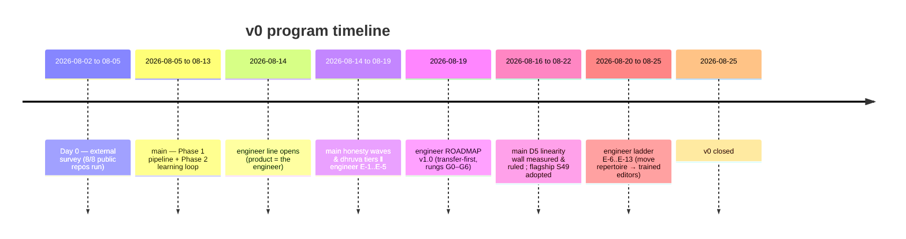
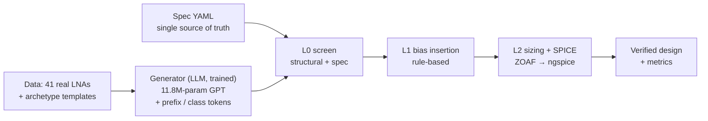
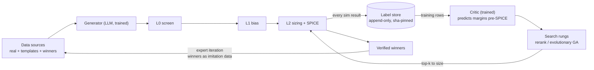
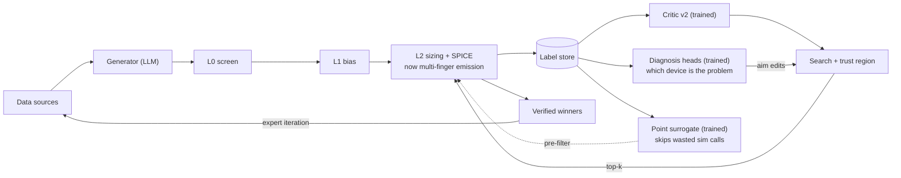
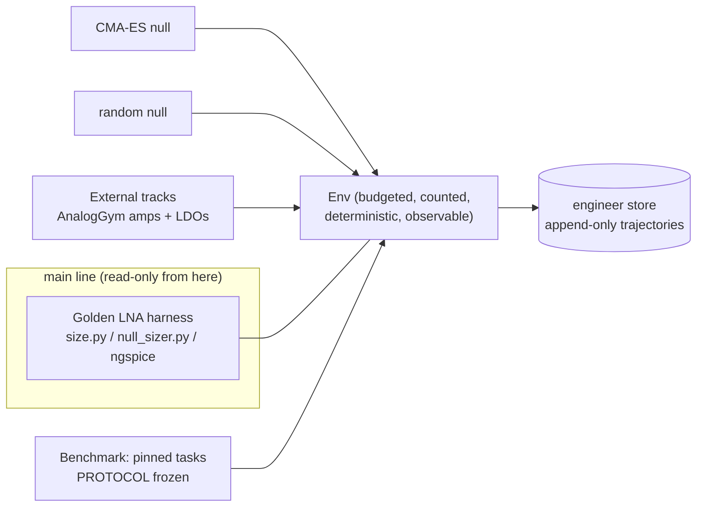
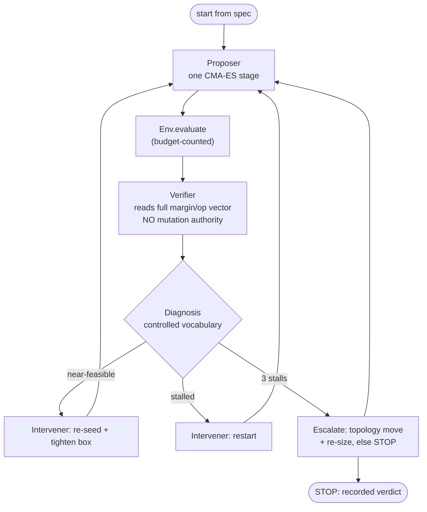
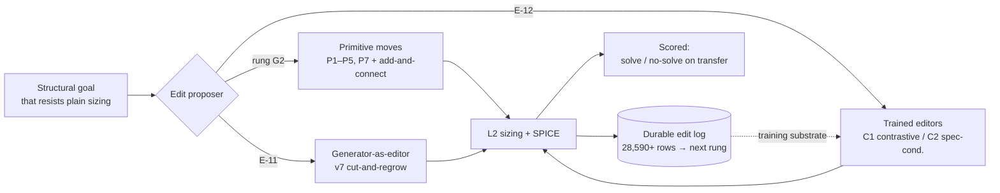

# v0 Retrospective — the LNA / autonomous-engineer program, day 0 to 2026-08-25

This document closes out the **v0** line of work. From here the program takes a
different approach, so this is the record of what v0 tried, how it was built, and
what it measured — in plain language, with numbers where they exist.

It is organized as the user asked:

1. A short **day-0** note on where we started (the external-repo survey).
2. For **each of the two work lines** (`main` and `engineer`), in chronological order:
   - **(A) what we changed and what we ran** — short entries, grouped by phase;
   - **(B) the results** — same order, same entry IDs.
3. **Structure diagrams** — how information flows through the pipeline, with a new
   diagram at every point where the structure itself changed.

Nothing here is inflated. Where a run produced a negative or a null result, it is
labeled as such. Every headline number traces to a committed artifact
(`lna/FINDINGS.md`, the `engineer/` pre-registration docs, or the scoreboards).

---

## 0. Glossary (30 seconds)

- **Topology** — the wiring of a circuit (which device connects where), no values yet.
- **Sizing** — picking the device values (widths, resistances…) so the circuit hits
  its spec. Done by a black-box optimizer (ZOAF, later CMA-ES) driving SPICE.
- **Bias** — the DC setup that switches transistors on. Training circuits omit it, so
  it must be inserted before a generated circuit can even be simulated.
- **The metrics** — NF (noise figure, lower better), S21 (gain), S11 (input match,
  want ≤ −10 dB), Idd (current), IIP3 (linearity), K/µ (stability).
- **L0 / L1 / L2** — the three evaluation rungs: structural/spec screen → bias
  insertion → sizing + SPICE. Nothing expensive runs before the cheap screen passes.
- **NDL@256** — "Novel Distinct LNAs per 256 samples": the frozen score for how much
  genuinely new (not copied) LNA structure the generator produces.
- **dhruva** — the flagship target: a published GNSS-receiver LNA the pipeline tries to
  match **without ever being shown the paper's circuit** (the "blind protocol").
- **Feasible** — a sized design that meets every gated metric of its spec at its tier.
- **Falsifier** — a result, written down *before* a run, that would refute the
  hypothesis. Every scored experiment pre-registered one.

---

## 1. Day 0 — the external-repo survey (2026-08-02 → 2026-08-05)

Before any in-house work, 11 published AI-circuit systems were cloned and smoke-tested
to find what could be reused. Result: **8 of 8 works that ship public code ran
end-to-end; 3 had no public code at all.**

| Category | Outcome |
|---|---|
| Topology generators | **AnalogGenie** (11.8M-param GPT, 3,351 circuits) was the only real generator that handles inductors and has LNA examples. Chosen as the base model. |
| Sizing / optimization | **ZOAF** (zeroth-order) and **AutoCkt** (RL) both ran; RL needed a full ngspice-in-the-loop stack (verified working under WSL). |
| Simulation / measurement | **ngspice** already does NF, gain, match, S-parameters — the *measurement* side was ready. |
| Looked reusable but wasn't | **ZeroSim / RoSE / AnalogSAGE** — blocked on unpublished data, Cadence, or a domain that can't model LNAs. |

**The one-line takeaway that set up everything after:** the measurement side existed;
the **targeting** side (ask for an LNA, bias it, size it to a spec) did not. Building
that gap is the whole program. Full detail: `STATUS.md`.

The program then split, over time, into two lines that share one repository:

- **`main`** — build and push the LNA pipeline; run the dhruva blind case study.
- **`engineer`** (from 2026-08-14) — reframe the *product* as the reusable
  environment + benchmark, and measure whether "autonomous engineer" features
  actually help. Runs largely in parallel with late `main` work.

---

## 2. The `main` line — the LNA pipeline

### 2A. What we changed and what we ran (chronological)

Entries are grouped by phase. Each `M#` is one change-and-run step. Numbers for each
are in **§2B**, same IDs.

#### Phase 1 — build the pipeline (spec → generate → bias → size → verify)

- **M1 — Import the pipeline & freeze the vocabulary.** Put the AnalogGenie generator
  under version control; froze the 1005-token vocabulary with a regression test so a
  checkpoint's output can never be decoded into the wrong device names.
- **M2 — Spec format + spec-driven screen (L0).** Added a machine-readable spec (band,
  NF, gain, match, power, topology limits) as the single source of truth; the L0 screen
  derives its pass/fail criteria from the spec's own fields.
- **M3 — Prefix conditioning (the first win).** Instead of sampling the generator blank,
  seed it with the first ~12 tokens of a real LNA and let it continue.
- **M4 — The honest scoreboard (NDL@256).** Froze a protocol that counts only LNAs that
  are *novel* (not a graph-copy of a reference set) and *distinct*, plus a "regression
  quartet" of checks that must stay green before/after every change.
- **M5 — Bias insertion (L1) + floating-subcircuit detector.** Rule-based biasing so a
  generated transistor actually conducts; a detector for floating sub-circuits.

#### Phase 2 — add learning (predict before you pay for SPICE)

- **M6 — The label store (Gate G4, by hand).** Added an append-only store of every
  expensive simulation (previously thrown away). Hand-designed one reference LNA and
  sized it to full feasibility so the store had a feasible example at all.
- **M7 — The critic + mandatory simple baselines (Gate C1).** Built mean / nearest-
  neighbor / ridge baselines *before* any GNN, tested on a normal split and a
  "source-shift" split (train real, test generated).
- **M8 — P5: break the memorization ceiling (Gate G4 by generation).** Mixed ~92
  hand-written archetype templates into the fine-tune corpus.
- **M9 — The self-improvement loop.** Made "SPICE-minutes per feasible novel design"
  the headline; folded verified winners back in as ordinary imitation data (expert
  iteration, not RL); added replay fences after a regression made the curve *worse*.

#### Phase 3 — broaden, then the dhruva blind campaign

- **M10 — Harder specs (gps-l1, wideband-sdr).** New archetype families to break a gain
  wall.
- **M11 — The dhruva blind protocol.** New goal: match a published GNSS LNA's numbers
  without the pipeline seeing its circuit. Removed the paper PDF; only a spec-number
  excerpt allowed anywhere; a hand-authored generic archetype (`rfb_cs3`) was tried
  across all four bands.

#### The honesty waves (re-measure everything under correct physics)

- **M12 — The NF reckoning.** Replaced the old (broken) noise measurement with the
  physically-correct one and re-judged all 14 "feasible" designs.
- **M13 — The metric-honesty audit.** Broad audit of measurement bugs (label-noise
  pooling, a critic silently dropping broadband rows, novelty reference counting
  template copies). Two fixes touched frozen protocols → sent to user for sign-off.

#### Search, data, and the critic maturing

- **M14 — Evolutionary search (Rung 2).** A genetic algorithm over one-edit graph
  mutations, with a trust region guarding the critic's off-distribution weakness.
- **M15 — The template question, asked three ways.** Removed templates outright, then on
  a schedule, to test whether they cause or merely mask copying.
- **M16 — Real-data expansion (41 → 50 circuits).** Ingested 9 real LNAs from open
  silicon tapeouts and papers through a six-gate vetting ladder.
- **M17 — Critic v2 + live rerank (Rung 1).** Repaired most of the off-distribution
  collapse; ran the critic live to rerank a pool for the first time.

#### The Gate-D3 arc (NF on a dhruva band) and the biggest correction

- **M18 — D3 diagnosis deepened + device-budget widenings.** NF gate diagnosed in
  public across attempts; device budget widened 16 → 18 → 21, each time calibrated to
  the device count of the nearest real silicon LNA (never to "what closes the gate").
- **M19 — The multi-finger cutover (the biggest correction).** The harness had emitted
  each transistor as a single finger, piling hundreds of ohms of fake gate resistance
  onto RF devices. Switched to realistic multi-finger layout (2 µm/finger, user-approved)
  and re-measured everything.
- **M20 — The match wall + structural instrument.** With noise solved, designs still
  failed input match. A pure-graph instrument (no formulas, honoring the blind rules)
  isolated the "source-driven input" motif and selected for it.

#### Instrumentation the pipeline had been throwing away

- **M21 — Operating-point capture.** Every simulation had solved a full DC operating
  point and kept one number; started capturing all of it (validated to zero error).
- **M22 — The 66,000 free labels.** Every sizing run had been logging its interior
  points for free; analyzed them to see how much of a sizing run is wasted.

#### The null hypotheses that bit back

- **M23 — The no-learning generator (the cheap null).** A generator with *no learning*
  — random wiring inside the device budget — run head-to-head against the trained one.
- **M24 — Outcome conditioning + shuffled-label control.** Told the generator what its
  circuits measured; ran a shuffled-label control to see if the *meaning* of the labels
  mattered.
- **M25 — The sensitivity sweep.** Perturbed the flagship design's supply ±1% to see
  which metrics are knife-edge.

#### The terminal finding — the D5 linearity wall

- **M26 — D5 measured two independent ways.** A harmonic-balance harness (VACASK) and a
  separate ngspice two-tone transient harness, on two different simulators and device
  models.
- **M27 — WP-LIN: does any in-box lever reach the wall?** Rungs 0–4, a budget-widened
  retest, and a stability check — the full search for any sizing/perturbation lever that
  closes D5.
- **M28 — The other tier-3 gates on the flagship.** D4-SIM (all four bands' tier-1+2 at
  one fixed sizing), D6 (gain programmability), D7 (differential output via an
  assistant-authored active balun).
- **M29 — Flagship S49 hardened + adopted; P5-v8 retrain tested and rejected.**
  Worst-case-margin descent from the flagship point; a warm retrain (v8) with 2 more
  externals measured against v7.

### 2B. Results (same order as §2A)

| ID | Result (numbers) |
|---|---|
| **M1** | Vocabulary frozen at **1005 tokens, byte-identical to upstream**; token↔netlist round-trip is exact (device-for-device). Guard test green. |
| **M2** | Spec becomes single source of truth; L0 screen derives criteria from it. Constraints are either **gated** or **`unsupported`** (declared-but-unmeasured, never silently passed). |
| **M3** | LNA-shaped output rate **0% → 40.6%, with no retraining**; **94%** of candidates reach a working sim; **16** genuinely distinct topologies per run. Known ceiling: longer prefix → higher hit rate but the output becomes a verbatim copy (yield-vs-novelty tension). |
| **M4** | First NDL@256 baseline = **16**. Regression quartet declared and kept green thereafter. |
| **M5** | R-GATE (always on) gives every floating gate a DC path; R-SOURCE/R-DRAIN opt-in. A monotonic guard ensures no bias rule ever makes conduction worse. |
| **M6** | Append-only label store live — "the product" every learned component trains against. Snapshots pinned by line-count + sha256 so a critic version always sees exactly its training rows. |
| **M7** | Baselines worked on a normal split but **collapsed on the source-shift split**. Every failure traced to one root cause: **the generator had memorized ~35 training graphs** — no critic can rank a pool of near-duplicates. Lever = the generator's data, not the critic. |
| **M8** | The ceiling broke: novelty jumped, copying dropped, inductors returned, and a **generated 8-device LNA sized to full feasibility**. Lesson (repeated after): *fixing a bad distribution beats filtering it.* |
| **M9** | SPICE-minutes per feasible novel design: **967 → (a worse turn, recorded honestly) → 367 → 187**, as the design count rose **1 → 3 → 6**. The regression that made the curve worse is *why the replay fence exists*. |
| **M10** | New families broke a gain wall, but input match wouldn't co-close. Later (M13) two claimed "generated discoveries" turned out to be exact template copies — the *sizing* stood, the *discovery* claim didn't. |
| **M11** | `rfb_cs3` hit the spec on all four bands — recorded honestly as **assistant-authored, not a neural-generator discovery**. That attribution is the point of the protocol. |
| **M12** | The old NF measurement had **flattered every design (by up to +12 dB; some read negative NF)**. Re-judged 14 feasible designs: **tier-1 held for all 14; tier-2 (NF) held for only 2**. Lesson: a supported-but-missing metric counts as fully violated. |
| **M13** | Found and fixed a label-noise pooling bug, a critic silently dropping ~240 broadband rows, and a novelty reference scoring template copies as "novel." Two protocol-touching fixes went to explicit user sign-off. |
| **M14** | Found a **novel, stable dhruva-s design** — but exposed that the critic **collapses off-distribution** (coverage, not capacity). The fancy "uncertainty gate" never fired; the simple "stay near training data" trust region did the real work. |
| **M15** | Removing templates kept **~half the novelty but lost most of the yield** (screen pass **80% → 36%**). On a schedule, novelty fell monotonically ("copying migrates, it doesn't stop"). Conclusion: templates are load-bearing because they **crowd out memorization**; the lever is *more varied data*. |
| **M16** | 41 → 50 circuits. The 9 externals bought the **single largest novelty jump of the program (+52% / +95%)** from just **5.8%** of the rows, by displacing archetype copying. Costed, not free. |
| **M17** | Critic v2 repaired most of the off-distribution collapse; run live, its edge was **largest exactly on NF** — the constraint dhruva was stuck on. |
| **M18** | Budget widened **16 → 18 → 21**, each step matched to real silicon. Honestly noted: the gate needed **20** devices, not the 21 granted. **D3 MET on dhruva-s** — first NF-gated feasible dhruva LNAs, independently re-audited. Winning insight: **grow the *quietest* parent, not the best one.** |
| **M19** | Single-finger emission was **26–40% of the measured "noise"** — a layout artifact. After the cutover, **one fixed design meets tier-2 NF on all four bands at once**. It also revealed the old harness **overstated every published NF by ~2 dB** and had flattered a stability number. A negative that survives its confound and points somewhere new. |
| **M20** | The "source-driven input" motif carries the whole match / no-match split. Selecting for it produced a **generator-authored dhruva-l5 design that met Gate D3**. Rule: a capability negative is only as strong as the selector that produced its candidates, and must name it. |
| **M21** | Operating point captured with **zero error**. Revealed the sizer had *independently* discovered textbook RF biasing (moderate inversion for input devices, strong for output) with nothing telling it to. |
| **M22** | A perfect pre-filter would skip **82.6%** of a sizing run's simulator calls — four of every five minutes are spent on points that never beat the incumbent. **The waste is in the search, not the simulator.** |
| **M23** | The no-learning random generator **beats** the trained one on **both** headline metrics (screen pass rate and NDL@256) — because a random graph is never a copy. But once SPICE runs, only **3%** of random circuits have working transistors vs **68%** for the trained one, and the random arm produces **zero** feasible designs. What the 11.8M-param model buys is **DC viability and gain capability — and neither headline metric can see that.** |
| **M24** | Conditioning raised novelty — but a **shuffled-label control raised it just as much**. The novelty came from the new training rows, not the labels' meaning. Outcome conditioning **rejected**. |
| **M25** | The flagship's match and current draw are **knife-edge (±1% supply flips them)** — by construction, because the optimizer pins them at their limits. **Noise and gain never flip.** Real parts hold current with a bias circuit the vocabulary doesn't have. |
| **M26** | The two harnesses **agree to 0.08 dB** on two different simulators / device models. Verdict: **Gate D5 fails by 21–27 dB**, and it's *not* a sizing problem — output linearity (OIP3 ≈ +3 dBm) is **flat** across bands and sizings. It's set by the output stage's swing budget on a 1.1 V / 13 mA envelope. |
| **M27** | **No in-box lever reaches the wall.** The wall doesn't move under perturbation (**worst 2.26 dB vs a 5 dB falsifier**). Even granting every allowance the paper permits, **more than half the miss survives**; passing would need an output intercept **~33–55× the entire DC power budget**. Closing D5 requires *changing what the circuit is*, not re-sizing it. Null recorded per user ruling. |
| **M28** | **D4-SIM, D6, D7 all met** on the flagship point (D4-SIM was already true the day the gate was set). |
| **M29** | Flagship **S49** hardened and adopted; deterministic param reconstruction; **replay 16/16**. **P5-v8 rejected**: NDL **50/38 vs v7's 57/35** (same-stick) — worse — so **v7 stays adopted**. (Aside, from the sizer comparison: at matched compute **CMA-ES beat ZOAF 4/5 vs 1/5** feasible.) |

**Where `main` ends:** the flagship dhruva design is **tier-1 + tier-2 feasible on all
four bands at one fixed sizing**, with gain programmability (D6) and a differential
output (D7). The one open gate, **D5 (linearity), is a measured, stable, physical wall**
that needs a *different circuit*, not more sizing — and the vocabulary has no bias
network to hold current over temperature. That wall is the reason a "change the
circuit class" capability was handed to the `engineer` line (rung G2).

---

## 3. The `engineer` line — the environment, the benchmark, the honest tests

The `engineer` line reframes the product: **the engineer, not the LNA**. Concretely an
*environment* (a budgeted, counted, deterministic, observable wrapper over the golden
harness), a *benchmark* (frozen tasks pinned to the exact stored results they cite), and
the dhruva case study as a demonstration. Its discipline: **every scored experiment
pre-registers its design, acceptance criterion, and falsifier in a commit *before* any
scoring run**, so a result can only confirm or refute.

### 3A. What we changed and what we ran (chronological)

#### Foundations — environment, benchmark, calibration (E-1 … E-2)

- **E1 — E-1: API hardening.** Turned the one working seam into a real API another driver
  can hold: round-trip, foreign-topology, non-sizable, and failure-mode tests; a second
  random-search driver as the falsifier.
- **E2 — E-2: benchmark protocol (frozen v1.0) + in-house scoreboard.** Wrote and committed
  `PROTOCOL.md` *alone, before any scoring run*; ran 7 in-house tasks × 2 null arms
  (CMA-ES, random) × 10 seeds.
- **E3 — E-2 externals: AnalogGym op-amp calibration.** Imported the field's open op-amp
  benchmark (14 amps) through a compatible adapter so "our sizer is good" is a claim about
  more than our own data.
- **E4 — E-2 externals: AnalogGym LDO calibration.** A second, qualitatively different
  circuit class (4 LDO families; regulation / PSRR / dropout, not gain/GBW).

#### The two "does it help?" experiments (E-3, E-4)

- **E5 — E-3: does memory help?** Ran a playbook-informed multi-start search *warm*
  (memory on) beside its *cold* twin (empty store), structurally inseparable, 70 paired
  runs.
- **E6 — E-4: does an unattended loop help?** A scripted (not LLM) propose → simulate →
  diagnose → intervene loop, fully unattended on 10 seeds, compute-matched to the null.
- **E7 — E-5: packaging.** A *draft* inventory of what a public release would contain
  (license audit, data manifest, scrub list), one open question per row.

#### The reframe — transfer-first operating model (ROADMAP v1.0, rungs G0–G6)

- **E8 — ROADMAP v1.0 + G0 fairness rules (PROTOCOL v1.1).** After E-3/E-4 both lost to a
  plain baseline, the user reframed the contest: the engineer is **not** trying to beat
  tuned-main on dhruva (its home turf, ~40 stages of human tuning) — it must traverse
  *unassisted* the journey that produced tuned-main, on tasks the tuning doesn't transfer
  to. G0 froze "fresh task", a contamination ledger, and time-to-competence metrics.
  Primary metric ruled: **SPICE-minutes to first spec-feasible design** (novelty is
  explicitly not an engineer objective).

#### The capability ladder (E-6 … E-13)

- **E9 — E-6 (G1): budget allocation.** Racing / successive-halving multi-start (many short
  starts to triage, full remaining budget to survivors) vs the single full-budget
  incumbent — the direct fix for the E-3/E-4 budget-fragmentation mechanism.
- **E10 — COLDSPEC (ism58): a cold fresh-spec generation** with no topology hints — a first
  cold transfer probe.
- **E11 — E-7 (G2): move repertoire.** Extend the graph-edit set (primitives P1–P5, P7 +
  an atomic add-and-connect) until escalation can change an output stage's class; a
  three-arm reachability test (blame-guided vs random vs null).
- **E12 — E-8 (G3): capability ladder + non-fragmenting memory.** A stratified set of
  structural goals; a sizing-only null filter to keep only goals that *resist* plain
  sizing; blame-guided vs random editing at scored budget. Re-authored as **v2** with a
  max-variety goal set and a coverage-correlation question.
- **E13 — E-9: two-stage structural (budget split by job).** Does splitting the budget
  between "find structure" and "size it" lift the ceiling E-8 found?
- **E14 — E-10: gap audit.** Audit the 6 remaining goals under strict missing-metric rules;
  decide which are near-miss vs hopeless; pick the editor model.
- **E15 — E-11: generator-as-editor.** Use the adopted **v7 generator** to cut-and-regrow
  circuit segments (no hand-authored moves), with every proposed edit logged durably as
  future training data.
- **E16 — E-12: trained editors.** Train two editor models on the banked edits — **C1**
  (contrastive priors) and **C2** (spec-conditioned) — with easy-tier trajectory banking,
  answer-exclusion, leave-one-out, and a fresh-task transfer gate (`n78`, a new 3.4–3.6 GHz
  band).
- **E17 — E-13a: budget concentration.** A budget/selection sweep (`m`) after E-12, plus a
  verification pass to find the true cause of the flat-zero transfer results.

### 3B. Results (same order as §3A)

| ID | Result (numbers) |
|---|---|
| **E1** | The environment became a real API. `Env.evaluate` on a non-sizable topology **raises `NotSizable` before any ngspice call and before the budget is charged** (a raise, not a fake infeasible result). The second driver (`random_run`) ran against the public API with **no edits to `env.py`** — falsifier passed. Smoke: 150 evals / 300 ngspice calls. |
| **E2** | **PROTOCOL v1.0 frozen** (committed before any run). N re-registered 5 → 10. Scoreboard: **140 cells (7×2×10), 66,920 evals / 133,840 ngspice calls**. **CMA-ES feasible on 5/7 tasks; random 0/10 on every task.** Median rank CMA-ES = 1, random = 2. Seeds 1–5 reproduced **bit-identically** from the N=5 artifact (≤1e-6 replay tolerance). |
| **E3** | **14 amps, 280 cells, 280,000 evals / 560,000 ngspice calls.** **CMA-ES ranks first on 13 of 14 amps** (cross-amp median-rank 1.0 vs 2.0); median & best FoM 3–10× better on all 14. The in-house "sizer beats the null" result **replicates on the field's external benchmark** — a statement about analog sizing, not just our store. |
| **E4** | **4 families, 80 cells.** **0/10 feasible for *both* arms at budget 1000** — the LDO tasks are unsolved by either null (they need 15 targets met at once from uncompensated starts). CMA-ES still ranks first on objective medians (directional ordering holds). An honest calibration result, not a protocol failure. |
| **E5** | **70 pairs, 66,920 evals.** **Warm lost to cold on all 7 tasks** (median rank cold = 1, cmaes-null = 2, warm = 3). Memory was retrieved correctly (K=6 every warm cell), so it's a **measured negative**, not a retrieval bug: splitting a fixed budget into K short starts starves each of convergence. Deliverable = the warm/cold harness, which discriminated cleanly. |
| **E6** | **20 loops, 266 evals/side.** **The loop produced 0/10 feasible where the blind null produced 1/10**, at identical cost → **falsifier met (measured negative)**. The machinery worked (diagnoses fired, escalation produced genuinely novel topologies, ran fully unattended on all 10 seeds); the *result* was negative. Same mechanism as E-3: a staged loop that fractures a fixed budget can't reach the near-feasible region a single full-budget run finds. |
| **E7** | A **draft inventory only — nothing released.** One open question per row, awaiting user rulings. |
| **E8** | **ROADMAP v1.0 adopted** (user 2026-08-19); **PROTOCOL bumped to v1.1**. Scoring axis moves to **transfer** (tasks main never tuned on) + **time-to-competence**; a **contamination ledger** fences what may transfer in (harness always; playbook only if declared; seeds/selectors/budget calibrations never). Goal sharpened (2026-08-20): **capacity to hit specs in reasonable time, not novelty.** |
| **E9** | **E-6 SUSPENDED** (user, 2026-08-21) mid-run: the paired externals were halted at 116/360 (resumable); an in-house readout + 5-amp interim read were recorded and the **verdict deferred**. Budget-splitting was not yet refuted or confirmed as a family. |
| **E10** | First attempt **BLOCKED** — the generator was unavailable on the RHEL box (no torch, no checkpoint). Once available it **executed: HIT, 2/13 feasible** — but the **first feasible was a random control** (seq0000, 216 evals), i.e. cold generation reached feasibility but not via the learned path. |
| **E11** | Move repertoire **adopted** (P1–P5, P7 + atomic add-and-connect); **P6 rejected**. The three-arm reachability result: **guided ≈ random** — diagnosis-aiming did not beat random editing. This fed the main-line D5 re-ruling (the move set, not the diagnosis, is the binding constraint). |
| **E12** | Null-filter smoke: **4/9 goals resist sizing-only at 150 evals**. Scored core-4: **sizing-null 3/4, blame-guided 1/4, random 0/4 — falsifier NOT refuted**. v2 (max-variety, budget 600): **2/6 goals resist at 600**; scored **guided 0/6 vs random 0/6**. Coverage reported at every tier but correlation is untestable on a flat-zero outcome: the ceiling is **repertoire-limited, not diagnosis-limited.** |
| **E13** | **Guided two-stage 0/6, where sizing = 0/6 and random two-stage = 0/6. The E-9 falsifier FIRED.** Splitting the budget by job did not lift the ceiling. Recorded next lever: make the **edit-proposal step itself smarter** (a learned editor). |
| **E14** | **3 near-miss / 3 hopeless of 6** under strict missing-metric rules (amended; two goals swapped sides). Editor model chosen = the adopted main-line **v7 generator**, declared as a cross-line import in the contamination ledger. |
| **E15** | Two held-out goals **resist the full-budget null 0/3 each**; v7 regrowth smoke found **46 distinct L0-passers / 500 attempts (22.4% L0)**; **28,590 edit rows banked** as training substrate. Scored: **generator-as-editor 0/6, where sizing = 0/6 and primitives = 0/6 — FALSIFIER MET.** Ceiling located at **editor training / conditioning.** |
| **E16** | P1 banking **0/24** (all six easy goals flagged zero-solve). P1b boosted banking (near-miss anchors + bigger survivor budgets): **9/24 solves — the first-ever solves by untrained arm-C (v7)**. Editors trained with **zero sims**; C2 (spec-conditioned) smoke hit **50 distinct L0-passers in 137 attempts (65.7% L0)** vs untrained v7's 46/500 (22.4%) — training clearly moved the L0 bottleneck. **But P3 scored: trained editors 0 solves on DEV / HELD-OUT / FRESH — FALSIFIER MET** (flat zero even *with* pool widening). |
| **E17** | Budget concentration produced **no transfer solve** — but the verification pass found the **real cause: the "delta" that would make these goals solvable is absent from the sizing objective.** The flat-zero was not (only) an editor-intelligence problem; the objective itself couldn't see the thing being asked for. This is the finding that closes v0 and motivates the next, different approach. |

**Where `engineer` ends:** the environment, benchmark, protocol, and two external
calibration tracks are built and running, and **CMA-ES-beats-random replicates on the
field's own op-amp benchmark**. But the two flagship "AI engineer" features — **memory
(E-3) and an autonomous loop (E-4)** — both **lost to a plain baseline at matched
compute**, and the whole editor ladder (E-7 → E-12) returned **flat zeros on transfer**.
E-13a explains why: the structural goals asked the editor to change something the
**sizing objective never scored**, so no amount of smarter editing could register a win.
That diagnosis is the clean reason to stop v0 and change approach.

---

## 4. Structure — how the machine was built, and every time it changed

Below are the pipeline's block diagrams. Each new diagram marks a point where the
*structure itself* changed (a new block, a new loop). Trained models are marked; there is
**no reinforcement learning anywhere** in v0 — the two things that look like it are
*expert iteration* (winners folded into the next fine-tune as ordinary imitation data)
and the *genetic search*.

### Snapshot 1 — Phase 1: the linear pipeline (M1–M5)

A deterministic chain with one trained block (the generator). Spec drives the screen; you
can't reach SPICE without passing the cheap rungs first.

**What each block does.**

- **Spec (YAML)** — the target LNA, written as numbers (band, NF, gain, match, power,
  device limits). It is the only source of truth. Every block downstream reads its rules
  from here.
- **Data** — 41 real LNAs plus hand-written archetype templates, turned into training
  text.
- **Generator (trained)** — the one learned block. It emits a circuit as a token
  sequence. Prefix and class tokens steer it toward an LNA.
- **L0 screen** — a cheap structural check: does this look like an LNA worth simulating?
  No SPICE yet.
- **L1 bias** — adds the DC network so the transistors switch on. Rule-based.
- **L2 sizing + SPICE** — picks device values and measures them in ngspice. The expensive
  block.
- **Verified design** — the output: a circuit with real values and measured metrics.

**The connections.** Flow is strictly left to right. Nothing runs backward yet. The spec
feeds the screen. The cheap rungs (L0, L1) sit in front of the expensive one (L2) on
purpose, so no bad circuit reaches the simulator.

### Snapshot 2 — Phase 2: the learning loop is added (M6–M9)

New blocks: the **label store** (captures every expensive sim), the **critic**
(predicts post-sizing margins so search can filter before paying SPICE), **search
rungs**, and the **expert-iteration feedback** (verified winners become new training
data). This is the first time information flows *backward*.

**What is new here.** The pipeline gains a memory and a loop.

- **Label store (new)** — an append-only record of every expensive simulation. Before
  this, every result was thrown away.
- **Critic (new, trained)** — predicts the margins a topology would reach *after* sizing.
  It trains on the store. Its job is to filter candidates before we pay for SPICE.
- **Search rungs (new)** — rerank a pool by the critic, or evolve it (see §8), and size
  only the promising ones.
- **New backward connection** — for the first time information flows right to left:
  L2 → store → critic → search → back into L2. The pipeline now learns from its own
  results.
- **Winners → data (new)** — verified winners are folded back into the training text.
  This is *expert iteration*, not reinforcement learning. A winner is just more text to
  predict.

### Snapshot 3 — diagnosis heads + realistic emission (M17–M22)

Two structural additions: **diagnosis / blame instruments** (a separate model on the
critic backbone that says *which device* is the problem, used to aim edits), a **point
surrogate** trained on the 66k free interior rows (saves SPICE-minutes, not a ranking),
and the **multi-finger emission** change inside L2 that fixed the noise artifact. The
critic's off-distribution weakness is now guarded by a **trust region** in search.

**What is new here.** Instruments are added, and one existing block is corrected.

- **Diagnosis heads (new, trained)** — a separate model on the critic's backbone. It
  names *which device* is the problem. It aims edits; it does not rank.
- **Point surrogate (new, trained)** — a cheap stand-in for one ngspice call, trained on
  the 66,000 free interior rows (M22). It saves simulator time; it is not a ranking.
- **L2, changed** — the same sizing block now emits devices multi-finger (the M19 fix).
  The block's shape is unchanged; the physics is corrected.
- **Trust region (new connection)** — search now stays near the critic's training data,
  because the critic is weak off-distribution.

### Snapshot 4 — the `engineer` environment wraps the harness (E1–E4)

The `engineer` line does not change the pipeline; it **wraps** the golden harness in an
`Env` (budgeted, counted, deterministic, observable), adds a **frozen benchmark** of
pinned tasks, and pits **two null arms** (CMA-ES, random) against it — plus two external
calibration tracks (AnalogGym amps, LDOs) that import the *same* env contract.

**What is new here.** Nothing in the pipeline changes. The engineer line wraps it.

- **Env (new)** — a budgeted, counted, deterministic, observable interface over the
  golden harness. Every run is fair and repeatable.
- **Benchmark (new)** — a frozen set of tasks, each pinned to the exact stored result it
  cites, scored under a protocol fixed before any run.
- **Null arms (new)** — CMA-ES and random search, run through the same Env, as honest
  baselines.
- **External tracks (new)** — AnalogGym op-amps and LDOs, imported through the same Env
  contract, so "our sizer is good" can be tested off our own data.
- **Engineer store (new)** — its own append-only trajectory log. Everything under `lna/`
  is read-only from here.

### Snapshot 5 — the unattended loop (E6 / E-4)

The first closed **propose → simulate → diagnose → intervene** loop, with three
code-separated invariants: the Verifier can read everything but **mutate nothing**; the
Intervener is the **only** mutator; after 3 non-converged stages it **escalates** to a
topology move. Memory enters as *structure* (which move to try first), not as budget.
Result was a measured negative — but this is the structural shape.

**What is new here.** The first closed control loop.

- **Proposer** — runs one bounded sizing stage. It moves the design point; it does not
  judge it.
- **Verifier** — reads the full margin and operating-point vector every stage. It can
  read everything and change nothing.
- **Intervener** — the only block allowed to change the design. It maps a diagnosis to
  the next action.
- **Escalate** — after three stalled stages, it changes the topology (a real structural
  move), then stops if that also fails.
- **The connection that matters** — diagnosis feeds intervention, and intervention feeds
  the next proposal. Memory enters here as *structure* (which move to try first), not as
  extra budget.

### Snapshot 6 — the editor ladder (E11 → E16 / E-7 → E-12)

The final structural arc: make the *edit-proposal step* smarter. It climbs from
hand-authored **primitive moves** → **generator-as-editor** (the v7 model cuts and
regrows segments) → **trained editors** (C1 contrastive, C2 spec-conditioned, trained on
the banked edit trajectories). Each rung logged every edit durably as training data for
the next.

**What is new here.** The edit-proposal step itself gets smarter, over three rungs.

- **Primitive moves** — hand-written graph edits (add, remove, rewire).
- **Generator-as-editor** — the v7 model cuts a segment out and regrows it. No
  hand-written moves.
- **Trained editors** — models trained on the banked edit history (C1 contrastive, C2
  spec-conditioned).
- **Edit log (new)** — every proposed edit is written down (28,590+ rows) and becomes the
  training data for the next rung.
- **The connection** — whichever proposer is used, the flow is the same: propose an edit
  → size it → score it on a transfer task.

**The structural lesson v0 ends on:** every added block worked *mechanically* — the
critic ranked, diagnosis fired, the loop ran unattended, the editors trained and moved
the L0 bottleneck. But on **transfer** tasks the whole stack returned flat zeros,
because (E-13a) the goals asked the editor to change something **the sizing objective
never measured**. v0 proved the machine runs; it also proved that the objective — not the
editor's cleverness — was the binding constraint. That is the door the next approach
walks through.

---

## 5. What we store as data for the future

Everything the program learns from is written to disk as append-only records. Nothing is
deleted; new rows are added, and snapshots pin exactly what a model saw. This is the
substrate any future approach inherits.

**Main line — the label store (`lna/data/`, `datastore.py`).** Four append-only JSONL
tables plus a snapshot index:

| File | What each row is | Kept in git? |
|---|---|---|
| `topo_labels.jsonl` | one L2 sizing outcome: (topology, spec) → final metrics. The expensive prize. Keyed `(wl_hash, spec)`, no duplicate keys. | yes |
| `l1_labels.jsonl` | one L1 bias / operating-point sweep for a topology. | yes (while small) |
| `sim_points.jsonl` | one row per ngspice evaluation *inside* a sizing run — the ~66,000 free interior points (M22). | gitignored (bulk) |
| `op_points.jsonl` | the full DC operating point *inside* one evaluation (every node voltage / device region), captured by M21. | gitignored (bulk) |
| `snapshots.json` | named snapshots: for each table, its line count + sha256, so a critic version always sees exactly its training rows and later tampering shows up as a hash mismatch. |  yes |

**Main line — other durable data:**

- **The playbook (`lna/playbook/`)** — 40+ program stages distilled into machine-queryable
  entries of (decision, evidence, outcome) plus edges between them.
- **The frozen NDL@256 protocol and its reference pools** — pinned so a novelty number is
  reproducible against the exact reference it was measured under.
- **The corpus (`lna/data/external/`)** — the 50-circuit real set, each external with a
  `provenance.json`, plus `corpus_manifest.json` (source, license, vetting gates).
- **Winners** — verified designs fed back as training text (true SPICE numbers only;
  critic scores never select training data).
- **The flagship design points (`lna/repro/dhruva-best/*.params.json` + `.meta.json`)** —
  the exact device values behind every gate claim, reconstructable deterministically.

**Engineer line — its own store (`engineer/data/`):**

- **`trajectories.jsonl`** — one row per evaluation: (state, action, outcome, cost). Every
  run, from day one, appended in one serial pass so the append-only law holds under
  parallel workers.
- **The scoreboards** — `scoreboard_v0.1.json` (in-house), `scoreboard_ext_v0.json`
  (AnalogGym amps), `scoreboard_ext_ldo_v0.json` (LDOs), `mem_pairs_v0.json` (E-3 warm/cold),
  `loop_v0.json` (E-4). Each pinned to its pre-registration SHA.
- **The goldens** — fixed-sizing → fixed-metrics replay fences (e.g. `ext_golden_v0.json`).
- **The durable edit log** — the 28,590+ `(state → edit → outcome)` rows from E-11, plus
  the E-12 banked solves. This is the training substrate a learned editor would use next.

The rule that ties it together: **provenance is part of the key.** Rows produced under a
different NF method, device budget, sizing recipe, or bias-rule set are never silently
pooled for training, ranking, or noise estimation.

---

## 6. Our approach to sizing, end to end

Sizing is the L2 block: turn a topology into real device values that meet a spec, and
measure them. It is fully deterministic — no learning inside the loop. Code:
`lna/size.py`, `lna/spec.py`, `lna/extract.py`, `lna/null_sizer.py`.

**Step 1 — parameterize.** Every device value becomes a knob. The `.param` surface is
mapped to a vector `x` in `[0,1]^d`. The decode is per kind: **log-scale** for widths,
resistances, capacitances, inductances (they span orders of magnitude); **linear** for
bias voltages. The bounds come from the spec's own sizing box (`kind_ranges`), so the
optimizer can never propose a value the spec disallows.

**Step 2 — emit a parameterized SPICE deck (`prepared_body`).** MOSFETs are emitted
**multi-finger** (`w_finger = 2 µm` — the M19 fix; single-finger emission piled fake gate
resistance onto RF devices and inflated noise 26–40%). Inductors get a **finite Q**
(`inductor_q = 12`) to avoid the ideal-inductor singularity. Every device value in the
deck is a knob the optimizer drives.

**Step 3 — the objective (`spec.objective`), minimized, feasibility-first.** This is the
heart of it:

- **Infeasible point** → `1 + Σ(normalized constraint violations)`. Always worse than any
  feasible point.
- **Feasible point** → `−Σ(weighted normalized improvement beyond the floor)`. More margin
  is better.

So the optimizer first claws into the feasible region, then improves margins. Constraints
are **hard** (pass/fail); objectives are **soft** (improve only after feasible). A metric
marked `unsupported` (e.g. IIP3 before the two-tone rung existed) is loaded, reported as
UNMEASURED, and ignored by the objective — never silently passed. **NF is gated inside the
loop** whenever the spec asks (one extra ~0.07 s series-Rs ngspice call per evaluation),
because a supported-but-missing metric counts as fully violated and would otherwise
flatten the objective.

**Step 4 — the optimizer drives ngspice.** Originally ZOAF (a zeroth-order optimizer with
SGD/CGD phases); later **CMA-ES**, which won a matched-budget head-to-head (4/5 vs 1/5
feasible) and became the default. Either one calls the *same* objective on the *same*
deck; they differ only in which `x` they try next. Budget is counted as one tick per
objective call (two ngspice calls when NF is gated), identical for every arm.

**Step 5 — guards.** A **stability guard** (K/µ) rides the step-acceptance loops so a
polish step can never walk a design into instability. Box-clamping keeps every parameter
in range at every step. A monotonic bias guard upstream ensures no bias rule makes
conduction worse.

**Step 6 — log the free byproducts.** Every ngspice evaluation (→ `sim_points`) and the
full DC operating point inside it (→ `op_points`) are written to the store. This is where
the 66,000 interior rows (M22) and the operating-point capture (M21) come from — free, and
kept.

**Step 7 — output and verify.** The best point's metric vector costs no extra simulation
(it is kept from the evaluation that produced it) and is written as an L2 row keyed
`(wl_hash, spec)`. Two checks stand behind every sizing claim:

- **Replay fence** — re-measure the stored design from scratch; it must reproduce every
  gated metric (spread 0.0000 at this deterministic fidelity).
- **Anchor re-derivation** — strip a known-good reference to defaults, hand the sizer its
  topology and spec, and confirm it re-finds feasibility near the hand-tuned numbers. This
  validates the extractor, the objective encoding, and the budget at once.

---

## 7. CMA-ES — what it is, how we use it, what it achieved, where it stops

**What it is.** CMA-ES is Covariance Matrix Adaptation Evolution Strategy — a black-box
optimizer for continuous vectors. It keeps a Gaussian sampling cloud with three parts: a
**mean** (the current best region), a **covariance** (the learned shape and tilt of the
local landscape), and a **step size σ** (how far to sample). Each generation it does four
things: sample λ points, evaluate them, move the mean toward the best few, and update the
covariance and σ so the cloud reshapes itself to the landscape. It needs no gradients and
no problem knowledge.

**The exact formulation we use.** Hansen's standard `purecmaes`: rank-µ plus rank-one
covariance update, cumulative step-size adaptation, `λ = 4 + floor(3·ln n)`, `µ = λ/2`
with log-decreasing weights, `σ0 = 0.3`, and `x0 ~ U[0,1]^n`. No tuning, no surrogate.
Box limits are handled by **clipping** (projection), and the clipped point is what enters
the recombination — so the search never builds its covariance from a point it was never
at. One deliberate deviation from the textbook: a σ-clamp that stops it spending leftover
budget at σ ≈ 0.

**How it entered and how we use it.** It came in as the **sizer's null hypothesis**
(`null_sizer.py`): an untuned baseline to test whether ZOAF was earning its keep. It
shares everything that measures — the same objective, the same box and decode, the same
ngspice evaluation, the same budget accounting. It differs from the random arm and from
ZOAF in exactly one thing: which `x` it evaluates next. When it beat ZOAF at matched
budget, it became the default sizer and the engineer line's `cmaes` arm.

**What it achieved (the honest wins).**

- Beats random search at matched budget on the in-house tasks: **feasible on 5/7 tasks vs
  0/7** for random.
- **Replicates off our own data:** on AnalogGym's open op-amp benchmark it ranks first on
  **13 of 14 amps** (median-rank 1.0 vs 2.0), with 3–10× better FoM.
- Beat ZOAF **4/5 vs 1/5** feasible at matched compute.
- Fully **deterministic** — re-runs reproduce `best_obj` bit-for-bit.
- Produced the first NF-gated feasible dhruva labels.

**Where it stops (the limits, stated plainly).**

- **It sizes one fixed topology.** It cannot change the circuit. The D5 linearity wall is
  outside its reach by construction.
- **It finds knife-edge solutions.** Because the objective rewards pushing to the limit, it
  pins metrics at their boundary — the flagship's S11 and Idd flip under a ±1% supply move
  (M25).
- **It fragments badly.** Split into K short starts, each start starves — this is the exact
  mechanism behind the E-3 (memory) and E-4 (loop) negatives.
- **It is objective-bound.** It can only optimize what the objective scores. E-13a is the
  clean proof: the transfer goals asked for something the sizing objective never measured,
  so no amount of search could register a win.
- **It does not transfer.** Every run starts cold; nothing learned on one task carries to
  the next.

---

## 8. Deep dives on specific steps

### 8.1 The genetic algorithm (search Rung 2, M14 — `lna/evolve.py`)

*(This is the "genetic algorithm" referred to in the diagrams; in the chronology it is
**M14**, not M4.)*

It is a genetic algorithm over **circuit graphs**, not over device values. A population of
topologies is seeded from the LM / archetype / store designs. Each generation applies a
**single-edit mutation** — one of ~17 one-edit graph moves from `moves.py` (add a device,
remove one, rewire a connection, and so on). Each offspring is screened, sized, and scored.
Selection keeps the best, with two guards:

- A **trust region**: an offspring further from the store's own designs than a set "family
  radius" is rejected, because the critic is unreliable that far off-distribution.
- A **novelty bonus** that rewards genuinely new structure.

It is **not reinforcement learning** — there is no policy and no reward gradient. It is
mutate → measure → select. It won clearly on dhruva-s (found a novel, stable design) and
tied where the critic had no coverage. Its lasting lesson: the fancy "uncertainty gate"
never fired; the simple "stay near training data" trust region did the real work.

### 8.2 M20 — the match wall, and what "isolation" means

The generator's designs kept failing input match. "Isolation" here means finding the
**one structural feature** that explains the whole failure, and nothing else.

A structural instrument (`_match_struct.py`) reads each design with **pure graph
arithmetic — no device formulas**, honoring the blind protocol. It classifies each design
by a single binary fact: does the RF input port reach a transistor **source**, or only a
**gate**? Measured across 828 stored designs, that one fact carries the entire match /
no-match split, in every provenance class independently.

Why it splits so cleanly — on the honest multi-finger harness, among designs that already
hold the band match:

| input motif | rows | median NF | clear NF ≤ 2.5 **and** S21 ≥ 22.3 |
|---|---|---|---|
| gate-driven | 31 | **7.52 dB** | **0** |
| source-driven | 139 | **2.97 dB** | **54** |

A gate-driven input in this program is quiet only when it does *not* match, and noisy when
it does. The generator emitted the source-driven motif just **19.2%** of the time. When
the capability test was re-run selecting candidates by *that measured predictor* (instead
of "distance from known families"), **24 of 29 closed the band match and one closed the
whole gate** — a generator-emitted 16-device topology (`80aaf9f4a0cd7863`) that met Gate D3
on dhruva-l5. The fix was a **selection criterion**, not a new capability.

### 8.3 M24 — outcome conditioning, in detail (`WP-OUTCOME`, FINDINGS §32)

The idea: fold each design's measured metrics back into the generator's training data as
extra "outcome" tokens, so the model could be asked to hit a target performance bin. Two
arms were run:

- **OUT-C** — outcome-conditioned with the **real** labels.
- **OUT-S** — a **shuffled-label control**: the same new training rows, but the outcome
  labels randomly permuted so they carry no real information.

The result:

| arm | NDL (narrowband) | NDL (wideband) |
|---|---|---|
| OUT-C (real labels) | 99 | 89 |
| **OUT-S (shuffled control)** | **115** | **105** |

Conditioning raised novelty — but **the shuffled control raised it as much or more**. A
newly discovered `wifi24` tier-2 feasible design appeared, but its hash was in **both**
arms' pools, so the shuffled control found it too. Conclusion: the novelty came from the
extra training rows (a new data channel), **not from the labels meaning anything**.
(Nuance, recorded honestly: OUT-C did beat OUT-S on the downstream feasibility/quality
axes 7 of 7 — the labels were not worthless for quality — but for the headline *novelty*
claim the control took the credit.) Outcome conditioning was **rejected** as a novelty
lever.

### 8.4 M26 — the D5 linearity wall, measured two independent ways

**What is being measured.** Linearity is measured with a **two-tone test**: drive the
circuit with two closely-spaced tones and measure the third-order intermodulation product
(IM3). **IIP3** is the extrapolated input power at which IM3 would equal the fundamental.
Higher IIP3 = more linear. Gate D5 is the dhruva IIP3 target.

**Why two harnesses.** A single simulator's IIP3 number is easy to fake by accident — the
negative control shows a loose HB tolerance producing a fantasy **+133 dBm** where the true
answer is **+21.25 dBm**. Agreement across two independent engines makes the wall a fact
about the *circuit*, not the *tool*. The two harnesses are:

- **VACASK 0.3.4.rc1 harmonic balance** — a frequency-domain steady-state engine. Validated
  against a closed-form memoryless cubic (error −0.002…−0.039 dB) with the negative control
  above as a guard.
- **A sibling ngspice two-tone transient harness** (`check_iip3.py`) — a completely
  different simulator and a different BSIM4 implementation.

They agree closely. On the shared quantities the two engines match to **12.96322 vs
12.96318 mA** on current and **≤ 0.0003 dB** on gain; the later WP-LIN two-tone cross-check
agrees on IIP3 to **0.08 dB**.

**The verdict.** Gate D5 **fails on all four bands by 21–25 dB** (harmonic balance; 21–27 dB
across the full WP-LIN range), and the miss is *not* explained by the paper's min-gain
condition. It is not a sizing problem: output linearity (OIP3 ≈ +3 dBm) is **flat** across
bands and sizings. It is set by the output stage's swing budget on a 1.1 V / 13 mA
envelope. Closing it needs a **different circuit**, not more sizing.

---

## 9. Best circuits over time for D4-SIM, D6, D7

All three tier-3 gates were met on **one frozen topology** — `wl_hash ace8383c2fa68d03`, a
single-ended core of 30 parameters — with the sizing (and, for D6/D7, a small bolt-on
stage) changing over attempts. The benchmark in every row is the four **dhruva** bands:
**s** (2492.03 MHz), **l1** (1575.42), **l2** (1227.60), **l5** (1176.45). Full device
values live in `lna/repro/dhruva-best/*.params.json`.

### D4-SIM — tier-1 + tier-2 feasible on all four bands at one fixed sizing

| date | design ID / recipe | size summary | specs achieved (worst band) | note |
|---|---|---|---|---|
| 2026-08-13 | **dhruva-l5** of `ace8383c2fa68d03` (`mf2-v1`) | one fixed 12.963 mA point | NF ≤ **1.253 dB**, S21 **33.7–36.0 dB**, S11 **−10.001 dB** band-wide, Idd **12.963 mA**, K_min 19.9 | Designated D4-SIM point. Cross-eval **16/16** cells pass; replay 3/3, spread 0.0. **S11 margin only +0.001 dB** (knife-edge); **fails at 1.2 V** (Idd 14.879). |
| 2026-08-13 | **dhruva-simul** (`mf2-v1+harden-v1`), same topology | margin-hardened values | S11 **−11.012 dB** (+1.012), Idd **8.205 mA** (−37%), NF worst 1.726, S21 worst 32.003, K_min 17.2 | Passes at **both 1.1 V and 1.2 V** (9.463 mA, 3.5 mA spare); replay 5/5. Kept on file, not yet designated. |
| 2026-08-21 → **designated 2026-08-22** | **S49 / WP-RESIZE2** (worst-case-margin descent from `dhruva-simul`) | reconstructed deterministically | S11 **−12.826 dB** (+2.826), S21 worst **33.973 dB**, NF worst **2.021 dB**, Idd **10.038 mA**, K_min 10.7 | **FLAGSHIP.** All 4 bands PASS; original 16-cell matrix still 16/16; worst-case normalized margin ×3.7 (0.051 → 0.192). Replay 16/16. Binding constraint now NF at l5 (+0.479 dB). |

### D6 — gain programmability (≥ 10.6 dB range, ≥ 3 steps)

Mechanism: `out-bank` — three cumulative DC-blocked, NMOS-switched branches on the output
drain (W = 8 / 8 / 16 µm, all inside the spec's own W box). One netlist; the states differ
**only** in three control voltages, so the operating point (and Idd) is identical across
states.

| date | substrate | states → span | S11 / Idd | verdict |
|---|---|---|---|---|
| 2026-08-13 | **dhruva-l5** (the D4-SIM point) | S0→S3, span **11.23–11.46 dB** on all 4 bands, monotonic | S11 ≤ −10 dB band-wide every state; Idd **12.963 mA identical every state** | **MET** under proposed mapping; replay 3/3, spread 0.0. Max-gain state still passes every D4-SIM gate. |
| 2026-08-13 | **dhruva-simul** (hardened) | span **11.99–12.21 dB**; can reach 39.5–42.7 dB | S11 margin ~1.01 dB; Idd 8.205 mA | Same verdict, more comfortable (1.01 dB S11 margin vs 0.004; 4.8 mA headroom). |

**Honest caveat:** the pass buys gain *range*, not linearity. The mechanism sits after the
last gain stage, so IIP3 is unchanged — the paper's "IIP3 at min-gain" spirit is not met.
That is a topology/margin finding, and it is why front-end gain control cannot live on this
design at its match margin.

### D7 — differential output (imbalance ≤ 0.22 dB / ≤ 0.9°)

Mechanism: an **assistant-authored active balun** (`cscg`, CS + CG split-phase splitter)
grafted at `VOUT1`, built from the existing MOS/R/C/L vocabulary — no vocabulary or emitter
extension, no coupled inductors. The core (30 params) is **frozen**; only the stage's 13
parameters are free, all in-box.

| date | host | Sds21 (per band) | imbalance mag / phase | diff NF | verdict |
|---|---|---|---|---|---|
| 2026-08-13 | **dhruva-simul** (hardened) | 29.91–30.67 dB, all 4 bands | **0.119 dB** / **≤ 0.339°** (band-wide worst) | 1.339–1.738 dB | **MET.** Margins +0.101 dB / +0.561°. Replay 3/3 in-process **and** from a separate process, spread 0.0. |

**Note:** the designated l5 point had only 0.037 mA of Idd headroom — no room for any output
stage — so the hardened point was used as the host. A second stage (`dpair`) was also
authored and measured but the `cscg` splitter is the one that met the gate.

---

## 10. What actually points toward an intelligent tool

These are the concrete results that show the program is more than a script — that it does
things a competent engineer does. Each is measured, not asserted. The caveat comes at the
end, kept honest.

1. **A real optimizer that generalizes.** CMA-ES beats random search at matched budget, and
   it does so **off our own data** — 13 of 14 amps on AnalogGym's open benchmark. That is
   evidence the sizing engine is doing genuine search, not fitting our store.
2. **Emergent correct engineering.** The sizer **independently rediscovered textbook RF
   biasing** (M21) — moderate inversion for input devices, strong for output — with nothing
   telling it to. It arrived at a known-good practice on its own.
3. **Root-cause diagnosis, not just optimizing.** D5 was identified as a **physical
   output-swing wall**, not a sizing miss, and confirmed on two independent simulators. The
   program can say *why* something cannot be done and stand behind it.
4. **Non-obvious, correct heuristics it derived.** "Grow the **quietest** parent, not the
   best one" (M18) was the insight that first met the NF gate — the program found and
   verified it.
5. **Isolating a cause by structure alone.** The match-motif instrument (M20) found the
   single structural feature behind a persistent failure using pure graph analysis, then
   fixed it by selection — producing a generator-authored design that met the gate.
6. **It finds its own measurement bugs.** Single-finger fake gate resistance, +12 dB NF
   flattery, novelty counting template copies — each was caught by the program and the
   numbers were re-based on corrected physics. A tool that can catch its own errors is
   closer to one you can trust unattended.
7. **A trustworthy harness.** Cross-simulator agreement to ~0.0003 dB on gain/current and
   closed-form agreement on IIP3. Every autonomous claim rests on measurement you can
   believe.
8. **It knows what its own parts contribute.** The honest null (M23) showed the 11.8M-param
   model buys **DC viability and gain** (68% vs 3% working transistors), even though the
   headline metrics can't see it. The program understands where its value actually sits.
9. **It diagnosed the limit of its own experiment.** E-13a traced the flat-zero transfer
   results to the **objective missing the target quantity** — the program found the flaw in
   its own setup, which is exactly what redirects the next approach.
10. **Honest measurement infrastructure.** The environment, the frozen benchmark, and the
    pre-registration-with-falsifiers discipline meant the two big negatives (memory, the
    autonomous loop) were **measured and published, not buried**.

**The honest caveat.** None of this is yet a learned, closed-loop autonomous designer. What
v0 proved is narrower and real: a strong classical optimizer, emergent-correct sizing
behavior, correct root-cause diagnosis, a trustworthy harness, and honest self-assessment.
The *learned-editor* path — the piece that would make the loop itself intelligent — did not
clear its bar in v0, and the reason (the objective, not the editor) is what the next
approach is built to fix.

---

## 11. One-paragraph summary

v0 built, from an 11.8M-parameter borrowed generator and a trustworthy simulator, a full
**spec → generate → bias → size → verify** LNA pipeline; pushed one real blind target
(dhruva) to **tier-1 + tier-2 feasible on four bands** with programmable gain and a
differential output; and hit one **measured, two-simulator-confirmed physical wall (D5
linearity, 21–27 dB short)** that no in-box lever moves. In parallel it turned the harness
into a **measurable environment + benchmark**, showed **CMA-ES beats random on the field's
own op-amp benchmark**, and then tested the two headline "autonomous engineer" features —
**memory and an unattended loop** — and a whole **editor-intelligence ladder**, publishing
every result including the negatives: memory and the loop **lost to a plain baseline at
matched compute**, and the editor ladder returned **flat zeros on transfer** because the
sizing objective couldn't see what the goals were asking for. Nothing was overclaimed,
every frozen protocol change went to explicit sign-off, and the closing diagnosis
(objective, not editor) is what makes a **different approach** the right next move.
