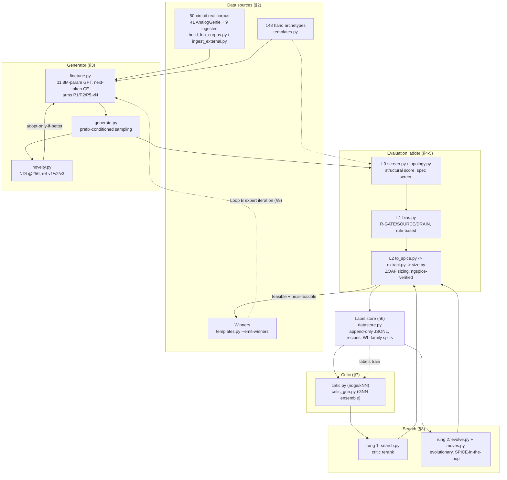
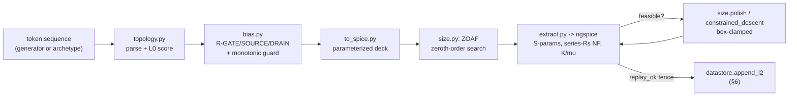

# The LNA Pipeline — Structure & Logic

**What this is.** `JOURNEY.md` tells the story of how this system came to be —
decisions, dead ends, who decided what, in chronological order. This document
is the other cut through the same repository: not *how we got here* but *how
the machine works today* — the building blocks, what feeds into what, and for
each block, what it actually is (trained model? deterministic optimizer?
hand-written rule?) and how it got that way. Read `JOURNEY.md`'s own preamble
first if you haven't; this document assumes the same vocabulary (specs,
gates, WP-names) without re-explaining it.

**Maintenance contract.** Any session that changes the architecture — adds a
block, retires one, changes what feeds what, promotes a metric from
`unsupported` to gated, adds a training arm, changes a frozen protocol —
updates the affected section here as part of its wrap-up, same discipline as
`JOURNEY.md` and `FINDINGS.md`. Cite sources inline (`FINDINGS §N`,
`HANDOVER Session N`, a file:line) rather than restating numbers from memory;
numbers drift, pointers don't. If code and a narrative doc disagree, trust
the code and note the disagreement rather than silently picking one.

**Blind-protocol note.** Same rule as everywhere else in this repo: nothing
here describes the Kanchetla et al. (TMTT 2022) paper's circuit — only the
spec numbers the user released, per §10 below.

---

## Map of the machine

The loop closes twice, at two different costs. **Loop A** (cheap): the
critic reranks or steers search candidates before they ever touch SPICE.
**Loop B** (expensive, ground-truth): SPICE-verified feasible/near-feasible
designs are re-emitted as `templates.py` "winners" and mixed back into the
generator's supervised training set (`finetune.py --winners`). Neither loop
is reinforcement learning — see §9's non-RL statement, which is deliberately
explicit because "self-improvement loop" invites the RL assumption and the
codebase contains none.

---

## 1. Representation & vocabulary

Circuits are token sequences: an Eulerian path over a device–pin graph, the
encoding AnalogGenie uses. `lna/genie_common.py` owns the vocabulary — 1,005
tokens (devices, per-device pins, net classes, `VDD`/`VSS`/`TRUNCATE`),
built **positionally** in `build_vocab()` so token *ids*, not just token
*names*, match the pretrained checkpoint exactly. This is checked, not
assumed: `test_vocab_matches_upstream.py` `exec`s the vocabulary-building
code straight out of `AnalogGenie/repo/Inference.py` on every run and asserts
list-equality against `genie_common`'s own build, plus hard ids
(`VOCAB_SIZE==1005`, `STOI["VSS"]==1003`, `STOI["TRUNCATE"]==1004`) — a live
regression guard against upstream drifting, not a one-time diff. What
`genie_common.py` adds over upstream is purely a serving-side speedup:
batched sampling, early stop once every row in a batch has emitted
`TRUNCATE`, and prefix conditioning (seed with an arbitrary token list
instead of bare `VSS`) — none of it changes what a token means.

`lna/topology.py` turns a decoded token sequence back into devices, nets,
and electrical nodes: pins and nets that are adjacent in the raw sequence
are wired together (union-find), so `Topology` reconstructs the same graph
regardless of which Eulerian traversal produced the sequence. Two
structural facts fall out of that reconstruction and matter downstream:

- **The structural LNA score** (`Topology.lna_score()`) is five booleans —
  has an inductor, inductor ratio ≥ 0.10, has a transistor, has both a
  `VIN`-class and `VOUT`-class net, device count in [2,15] — thresholds
  taken directly from the dataset's own 41-circuit LNA subset, where
  inductor share is ~20% of devices vs ~0.8% corpus-wide (FINDINGS §1).
  It's a purely structural score; nothing here has seen a volt.
- **Floating-subcircuit detection** (`floating_devices()`) builds a second
  union-find over the *node* graph and calls a component floating if it
  never touches a driven net (`VDD`/`VSS`/`VB*`/`VCM*`/`VREF*`/`VIN*`/
  `VOUT*`/`IB*`). Bias-insertion scaffolding (`RBIAS*`/`CBYP*`/`VBGEN*`,
  §4) is explicitly excluded from this check so that inserting bias can't
  hide a genuinely floating island — the detector that caught corpus index
  1081's real defect (an ideal-inductor branch singularity, not a floating
  subcircuit as first suspected — FINDINGS §1, JOURNEY stage 2) still works
  on generated topologies today.

Neither of these components is trained. They are deterministic parsers and a
hand-set structural rule, and they are the ground floor everything else
stands on: the generator emits token sequences, and every other block below
starts by asking `topology.py` what those tokens mean.

---

## 2. Data sources

Three things feed the generator, and they are not the same kind of thing.

**The 50-circuit real corpus** — 41 circuits native to AnalogGenie's own
3,351-circuit dataset (indices 461–492, 1081–1090) plus 9 externally
ingested real designs (IHP SG13G2 open tapeouts, an ALIGN example, cited
transcriptions from published papers) living under `lna/data/external/*`,
each with its own `provenance.json`. `build_lna_corpus.py` stages both: the
41 through AnalogGenie's own graph-building code (never patched, `exec`'d
from source), the 9 through `ingest_external.py`'s gate ladder — provenance
→ Eulerian augmentation → structural validity → vocabulary round-trip →
WL-hash identity — where a failure means quarantine, not a forced pass.
Result: **9 attempted, 9 ingested, 0 quarantined** (FINDINGS §19.2). "Eulerian
augmentation" is the same upstream DFS-all-paths / edge-cover algorithm
applied to every circuit, real or hand-built: one graph produces many
token-sequence traversals of itself (up to 200 solutions/circuit for the
corpus, a reduced schedule for the externals to keep the O(N²) cover-check
tractable), which is what turns 50 graphs into ~4,500 training rows. The
`ingest_external.py` provenance check also mechanically enforces the blind
protocol (§10): a circuit whose provenance text matches an excluded-source
marker is rejected regardless of how well it sizes.

**148 hand archetypes** (`templates.py`) are constructor functions, not
mined data: `cs_lna` (inductively-degenerated common-source, the narrowband
workhorse, with gate-inductor/degen/Cex/cascode/load/buffer options),
`cg_lna` and `rfb_lna` (inductorless wideband), `cs_cs_lna` and
`current_reuse_lna` (gain- and current-budget-specific), and — added under
the Dhruva blind protocol and tagged `recipe: blind-v1` — `rfb_cs_lna`,
`rfb_cs3_lna`, `gmb_cg_lna`, `nc_cgcs_lna` (generic textbook low-noise
families chosen *without* consulting the excluded paper). Every archetype is
written as a netlist and pushed through the same upstream Eulerian-DFS
augmentation as real circuits — there is no separate "synthetic" code path.
`--emit-winners` (Loop B, §9) reranks *already-sized* topologies from the
label store by `spec.objective()` per spec and keeps the top quartile (not a
fixed feasible cutoff) — "winners" are drawn from true SPICE numbers only,
never critic scores. Class tokens `<LNA_NB>`/`<LNA_WB>` tag a circuit by
whether `Topology(...).n_inductors >= 1` (inductor presence, not a declared
narrowband/wideband target) — a mechanical rule applied uniformly to corpus,
external, and archetype rows alike in `finetune.py`.

**Design decisions that matter:** the archetype/corpus split is deliberately
visible to the novelty metric — `ref-v2` extended the novelty reference to
include archetypes specifically because ~51% of one generation arm's
"novel" output was verbatim archetype regeneration under the narrower
`ref-v1` (FINDINGS §14.5, §10 below); and the 41→50 corpus growth was
measured to change *nothing* about existing pools' novelty scores under
`ref-v3` (§19.3) — real data was added as insurance for future training runs,
not because anything was broken.

---

## 3. The generator (LLM)

**What it is.** An 11.8M-parameter GPT-style model (`BLOCK_SIZE=1024,
N_EMBD=384, N_HEAD=6, N_LAYER=6`) — AnalogGenie's own pretrained checkpoint,
warm-started and fine-tuned on LNA-specific data. `lna/finetune.py` runs
several **arms**, each a different training-data recipe over the identical
architecture and objective:

- **P1** adds `<LNA>`/`<OTHER>` class tokens (new embedding rows,
  mean-initialized from pretrained ones) so the model can be sampled
  unconditionally for LNAs.
- **P2** is the same data, no vocabulary change, bare-`VSS` sampling — "the
  baseline the handover demands."
- **P5** (the productive line, P5-v1…v7) uses three class tokens
  (`<LNA_NB>`/`<LNA_WB>`/`<OTHER>`), mixes in the Eulerian-augmented
  `templates.py` archetypes (the "template scaffolding" lever — `--no-templates`
  is the control arm that measures how much of P5's gain is the scaffolding
  itself, FINDINGS §16), and a 15% `<OTHER>` replay so the model doesn't
  forget the rest of AnalogGenie's distribution.
  `--external-corpus` (P5-v7) mixes the 9 ingested real circuits into
  *training only*, holding validation byte-identical to P5-v3 so "expanded
  corpus" is the single changed variable (FINDINGS §19, §24).
  `--winners` mixes SPICE-verified winners from the store (Loop B, §9),
  warm-starting from the base P5 checkpoint into a separate `_v2`-suffixed
  file so the base is never overwritten.

**How it's trained — and what it is not.** The training signal is plain
next-token cross-entropy (`F.cross_entropy` over shifted token targets),
optimized with AdamW. That is the *entire* loss surface: there is no reward
term, no SPICE-derived scalar anywhere near the gradient, no policy-gradient
or value-function machinery in the file. "Winners" and "external corpus"
look like self-improvement but are exactly that and nothing more: curated
rows added to a supervised training set, still trained by the same
cross-entropy objective — the SPICE/critic signal only ever decides *which
rows get added*, never touches the loss (see §9's non-RL statement, which
applies equally here). Every fine-tune in the program **overfits by epoch
0–1** on the ~35-graph effective training set (val loss rises monotonically
after; FINDINGS §16, §18, §24) — `ckpt_policy="best"` saves only the
lowest-val-loss epoch, which is why "best-val" isn't a tuning choice so much
as the only checkpoint worth keeping. Training runs on a WSL-side GPU
(finetune.py's own comment: `# WSL GPU:`).

**Sampling** (`lna/generate.py`, plus `finetune.py`'s own `sample()` for
fine-tuned arms) is prefix-conditioned: seed with the first N tokens of a
real LNA traversal (or a class token) instead of bare `VSS`, batch B
heterogeneous-length rows through one forward pass, early-stop per row.
Temperature (default 0.7) scales logits before a plain `torch.multinomial`
draw — there is no top-k/top-p truncation anywhere in the sampler.

**The novelty protocol** (`lna/novelty.py`) is what makes "better generator"
falsifiable. **NDL@256** = the count of distinct (WL-hashed) topologies,
among 256 spec-screened samples, that are *both* structurally valid *and*
not WL-hash-identical to anything in a frozen reference set. The reference
itself is versioned — `ref-v1` (41-circuit corpus only) → `ref-v2` (+ 148
archetypes, because ref-v1 was letting archetype regenerations count as
"novel") → `ref-v3` (+ the 9 external circuits, a zero-effect correction
confirmed by measurement, §19.3/§10) — each version stamped with an 8-byte
blake2b digest over its sorted hash set, so every historical NDL number
stays reproducible against the exact reference it was measured under.
**Adoption governance** is "beat the frozen NDL at equal-or-better inductor
ratio," applied as a documented decision at each fine-tune, not a function
call — `_ndl_flipcheck.py` exists specifically to replay history against a
current reference and confirm no adopt/reject decision would flip. `loop.py`
backs this with five numeric **tripwires** (NDL drop >20%, WL-family count
drop >50%, repeat-probe σ drift >2×, feasible-rate >60% [signals a gameable
critic], critic-holdout regression) that must read quiet before any
iteration is allowed to proceed.

---

## 4. The evaluation ladder — L0 and L1

**L0 — structural/spec screen** (`lna/screen.py`, `lna/spec.py`,
`lna/topology.py`). Rule-based, not trained: `screen.py` is a CLI wrapper
over two scoring paths — the fixed 5-criterion legacy score
(`topology.lna_score()`, §1) or a spec-derived screen
(`Spec.structural_screen()`) that reads its criteria (inductor bounds,
`device_budget`, `allow_inductorless`, `differential`) out of the target
spec's own YAML `topology:` block, so a spec built for inductorless designs
doesn't unconditionally fail them the way the legacy screen would.

Every spec is a YAML file (`lna/specs/*.yaml`) with `constraints:` (hard,
pass/fail — e.g. `dhruva-l1.yaml`'s `s11_max_db: {max: -10}`, `s21_db: {min:
25.4}`, `nf_db: {max: 2.7}`), `objectives:` (soft, weighted, only compared
*among* feasible points), and `topology:`/`sizing:` blocks that drive the L0
screen and the L2 device box respectively. A constraint carries
`status: unsupported` when the harness genuinely can't measure it yet
(`iip3_dbm`, tier-3, needs a two-tone harness that doesn't exist) — such a
constraint is loaded, reported, and skipped by `feasible()`/`objective()`
entirely. Every other constraint is "gated": it counts toward feasibility,
and — this is the sharp edge — if a gated metric is *missing* from a run's
measured metrics dict, that counts as **fully violated**, not ignored. That
rule is what forced NF's harness fix before NF could be gated at all: NF
used to be silently forced to `unsupported` in code (`size._spec_for_sizing`)
regardless of what the YAML said, because the only NF measurement available
was an unphysical port-referred one; once the series-Rs NF harness landed
(§5), that override was deleted so sizing "honours the YAML" (HANDOVER
Session 4, WP-D1). "Advisory" (e.g. K/μ stability) isn't a spec-schema
keyword at all — those metrics simply have no `constraints:` entry and are
never gated, a stronger exclusion than `unsupported`.

**L1 — operating point** (`lna/bias.py`). Rule-based DC-path analysis, not
optimization: a MOS gate with no DC path to a driven net gets an inserted
bias resistor + bypass cap (**R-GATE**); every bias net, inserted or
pre-existing, gets bypassed (**R-CASCODE-BYPASS**, "the H-Q1 lesson
institutionalized"); a genuinely floating subcircuit is flagged and skipped,
not bypassed (**R-FLOAT**). Two more rules, opt-in as of 2026-08-09 because
they add real signal-path elements rather than pure scaffolding — **R-SOURCE**
(a source node with no DC path gets a return resistor: true degeneration)
and **R-DRAIN** (a drain node with no DC path gets a load-feed resistor) —
fix a *different* problem than R-GATE (measured split: 15 source-defects /
16 drain-defects / 12 load-sizing issues among off-MOS devices, HANDOVER
finding #9). They stay opt-in (env var or `--rules`) rather than default
because `size.py` calls `insert_bias` on every sizing run, and silently
changing every future label's sizing domain is not a decision to make by
default. A **monotonic guard** underlies the whole ladder: each bias
candidate is adopted only if it makes strictly more devices conduct than
the current best, so bias insertion can prove it never makes a circuit
*worse* — though the docstring is explicit that this does not prove the
*sizing* domain is unchanged, which is the actual reason v3 stays opt-in.

(L2 — full sizing — is §5, immediately below; it's grouped there with
verification rather than here because sizing and SPICE verification are the
same loop in this codebase.)

---

## 5. Sizing & verification

**`lna/to_spice.py`** turns a topology into a parameterized ngspice deck —
every device value is exposed as a `.param`, not a literal, which is what
makes the deck sizable at all. Two features were added under measured
pressure rather than speculatively: **finite-Q inductors** (`--inductor-q`,
default off) replace an ideal inductor with an `L` + series `R` at a
constant-Q band-center value, which both models real spiral loss and fixes
an ideal-inductor branch-current singularity that made corpus index 1081
fail to simulate at all (WORKLOG F6); and **NPN/PNP emission** (FINDINGS
§19.1) against hand-written, golden-checked Gummel-Poon `.model` cards,
added because one of the 9 ingested externals (an IHP SiGe-HBT GPS LNA)
had no bipolar model to emit against otherwise.

**`lna/extract.py`** is the single ngspice entry point — every caller in the
tree (`run_and_extract`, `measure_stability`, `measure_nf`, `bias.run_op`,
`templates.emit_paths`) routes through one `run_deck()`/`scratch()` pair
(write deck → run `ngspice_con -b` → parse → clean up the temp dir in a
`finally`). That cleanup is not decorative: before it existed, every ngspice
caller `mkdtemp`'d with no teardown and accumulated **685,287** stale scratch
directories before directory creation itself became slower than the sim it
served (FINDINGS §17.9) — `_nf_tmp_purge.py` swept the backlog once,
`extract.scratch()` prevents recurrence. Two measurements matter more than
the hygiene fix, though:
- **NF** is measured with a series-Rs noise deck (`measure_nf`), not the
  original port-referred `inoise_spectrum`, because the port source has no
  physical noise resistance once a stage has real gain (an unphysical
  measurement that flattered every stored design — HANDOVER WP-D1). The
  replacement is golden-validated against a closed-form ideal-gain-10,
  Rs=Rn=50Ω case (analytic NF = 3.0103 dB, measured 3.012469 dB,
  `ref/check_nf.py` green to 0.002 dB worst-case).
- **K/μ/Δ stability** falls out of the S-matrix the `sp` analysis already
  computes — zero extra simulation cost — and is reported at f0 and over a
  wide out-of-band sweep. It is advisory everywhere in the objective: a
  design can be sized fully feasible with K_min < 1 (two measured wifi24
  cases), because nothing in the sizing objective penalizes instability yet
  (open item, JOURNEY "Current frontier").

**`lna/size.py`** is the sizing loop, built on **ZOAF**
(`misc/ZOAF/zoaf_core.py`) — a vendored, generic **zeroth-order** black-box
optimizer (Sobol/Halton/LHS multi-start, then ZO-SGD for basin-escape
followed by ZO-CGD coordinate refinement); it never differentiates through
ngspice, only evaluates it. `size.py` maximizes a feasibility-first scalar
(`spec.objective`) over a log/linear-decoded parameter box. Three things
here are load-bearing:
- **Box-clamped bounded polish.** `polish()`'s coordinate ascent used to
  scale a parameter by `(1±step)` without ever checking `kind_ranges`, so
  it could (and did) walk designs outside their spec's own device box — one
  measured case reached an 18.1 nH inductor against a 15 nH `l_max`. Every
  polish/candidate step is now clamped, applied to both the incoming prior
  point and every trial move (HANDOVER Session 4; 6 of 19 stored feasible
  rows were found out-of-box before the fix, one tier-2 NF claim died on
  re-derivation).
- **`constrained_descent`** optimizes one target metric (e.g. minimize NF)
  inside a hard trust region on the other gated constraints, because
  `polish` structurally cannot spend non-binding slack: if NF is the only
  violated constraint, it already *is* the minimum margin polish optimizes,
  so a 12 dB gain surplus is valued at exactly zero. "Slack is currency only
  if something is allowed to spend it" (FINDINGS §17.1) is the design
  rationale in the code itself.
- **`replay_ok`** is an audit fence, not an optimizer: re-evaluating a
  stored `best_params` against the topology reconstructed from that same
  row's own tokens must reproduce the stored S11/S21 within tolerance before
  any further polish/reuse is attempted. It exists because a
  topology/params mismatch — e.g. a `token_file` re-parsed against the
  wrong arm's sequence file — is a real, previously-hit bug class.

**`lna/g4_search.py`** spends extra budget on the closest-to-feasible
candidates from a prior pass: multiple ZOAF seeds at a larger fixed budget,
best-of-k kept. Its **polish-first-convert** ordering is deliberate cost
management — try cheap `polish()` from the stored point first (~100 sims),
fall through to full multi-seed re-sizing only if that fails to close
feasibility, and polish the re-sized result too if needed — because a
near-miss usually converts for ~100 sims where a fresh multi-seed search
costs orders of magnitude more.

---

## 6. The label store

`lna/datastore.py` is a deterministic append-only JSONL store — no learning
here, only bookkeeping. Three tables in `lna/data/`: `topo_labels.jsonl`
(L2, one sizing outcome per `(topology, spec)`, git-tracked — "the prize"),
`l1_labels.jsonl` (L1 bias sweeps, cheap and abundant), `sim_points.jsonl`
(per-ZOAF-iteration points, a free byproduct, gitignored). Every L2 row
carries a **margins vector** — signed, normalized slack per constraint,
`(limit − achieved)/scale` on the binding side — which is the actual
learning target for the critic (§7), not raw metrics.

**Recipes and provenance are label-domain separators, not metadata.**
`zoaf_cfg.recipe` names the exact labeling protocol that produced a row
(`candidate-v1`, `candidate-v1+bo3` [best-of-k], `curated-v1`, `polish-v1`,
`blind-v1`/`blind-v1-nf`, `evolve-v1`, `rung1-v1`, `ingest-v1`, and
post-hoc migration bumps like `+nfrs-v1`), and `zoaf_cfg.nf_gated` separates
rows sized before vs. after NF became a hard constraint (§4). Mixing across
recipes or NF-gating without conditioning on them produces exactly the kind
of contaminated statistic the σ story below is about — so every consumer
(critic training, search, benchmark) is expected to condition on them, not
average over them blind.

**σ and repeat-probes.** `campaign.sigma_key = (wl_hash, spec, recipe,
nf_gated)` is itself a bug fix: the earlier key was just `(wl_hash, spec)`,
which pooled different recipes and different NF-gating into one "drift"
number and estimated a stdev from n=2 in most cells. Re-measured cleanly
on 19 wifi24 repeat-probe keys: **σ_single ≈ 1.478 dB**, and best-of-3
(`size.size_best_of_k`, recipe `+bo3`) halves it to **σ ≈ 0.726 dB** for 3×
the simulation cost (HANDOVER Session 4 Track C; FINDINGS §14.1) — quieter,
but still short of the ≲0.5 dB target, a known, stated limit rather than a
closed one.

**Snapshots** (`datastore.snapshot`) pin a named training set with a sha256
over its contents, re-verified on every load — an append-only invariant
that's checked, not assumed. **Family splits by WL-hash** (`family_split`,
using `novelty.wl_features`'s Weisfeiler–Lehman graph hash and a
`FAMILY_SIM=0.9` cosine threshold to cluster near-duplicates into one
family before hash-assigning whole families to train/val/test) exist
because row-level splitting leaks: median nearest-neighbor similarity hits
1.000 in some pools, so two "different" rows are routinely the same
topology at a different seed. Every critic-eval consumer calls this one
function — nobody constructs their own split.

`lna/campaign.py` runs stratified nightly labeling across four strata —
**T**emplates/reference decks (topology diversity), **G**enerated (screened,
WL-deduped against `ref-v2`), **M**utations (not yet built), **R**epeat-probes
(re-size already-labeled keys) — under a fixed quota, skipping anything
already labeled for that spec.

---

## 7. The critic

**Feature baselines** (`lna/critic.py`): **trivial** (train-mean),
**WL-kNN** (nearest labeled neighbor by WL-cosine, spec-conditioned), and
**ridge** (closed-form, λ=10, over graph-count features + a spec-descriptor
vector + a bag-of-WL-subtree-features vocabulary built from the training
set). All three predict the same normalized margin vector the label store
stores.

**The GNN ensemble** (`lna/critic_gnn.py`) is hand-rolled — its only imports
are `numpy`/`torch`/`torch.nn`, no graph-learning library. Message passing
is per-pin-role linear maps over the bipartite device↔net graph, three
rounds, sum+max pooling, spec-conditioning concatenated at the readout head,
which produces four margin outputs (S11/S21/Idd/NF; NF masked on rows
predating the series-Rs harness). Loss is masked Huber plus a pairwise
rank-hinge on S21 with the hinge margin set to the measured label-noise σ —
"don't fit below the noise floor" made literal. **Five ensemble members**
(different seeds); uncertainty is the ensemble standard deviation across
them, used both to rank prediction error and to feed search's `mean − β·σ`
selection rule (§8).

**Training data**: the `v4-train` snapshot (734 rows, 730 usable — an early
version silently dropped every broadband-spec row because `_margins` only
read `s11_db`, not `s11_max_db`, which meant the entire ~240-row Track-B
dhruva corpus never trained the critic until fixed, FINDINGS §14.2) and the
current `v5-train` (1010 rows / 1006 usable).

**Eval protocol — three splits, each testing a different generalization
question**: **family holdout** (held-out WL-family, the baseline
generalization test), **source-shift** (train on corpus+archetypes+
reference decks, test on generator output — the question that matters for
"can the critic actually guide sampling," discriminated by provenance, not
by a single hardcoded arm name, which is what widened the generated eval
pool 142→420 rows), and **mutant** (test on `evolve.py`'s 1-edit structural
perturbations, held out by WL-family in 3-fold CV — the distribution
`evolve.py` actually searches, as opposed to the distribution the generator
samples from).

**Gate C1**, restated (FINDINGS §14.6): Spearman **ρ(S21) ≥ 0.5** on
held-out families, *and* a **skill ≥ 0.25** where
`skill = (precision@20% − base_rate)/(ceiling − base_rate)`. The restatement
exists because the original "enrichment ≥ 2×" bar's ceiling
(`min(1/k_frac, 1/base_rate)`) falls as the labeled pool's base feasibility
rate rises — it fell from 3.74× to 2.20× on the source-shift split as
labeling simply got better, which made "≥2×" silently mean "near-perfect
precision," an unreachable and backwards bar. On `v4-train`: family-holdout
ρ(S21) 0.79 (ridge) / 0.85 (GNN), source-shift 0.585 (ridge) / 0.61 (GNN) —
**★ the source-shift gap closed** from a pre-fix 0.221, which is the number
that justified promoting the GNN to critic-of-record over ridge (it wins
family split and is the only arm with usable ensemble uncertainty), even
though ridge ties or beats it on some source-shift statistics — "not a
clean sweep," stated as such in FINDINGS §14.2.

**Known limits.** Off-distribution decay is measured, not inferred: the
critic holds ρ ≈ 0.83 in-distribution but collapsed to ρ ≈ +0.17…+0.20 on
`evolve.py`'s search distribution before mutant-labeled rows existed
(FINDINGS §15.4), and adding 213 evolve-sourced rows repaired it only
partway (ρ ≈ 0.44–0.50, still ~55–60% of in-distribution performance, §20.2).
A **σ-percentile uncertainty gate was retired** after being found inverted:
mutant-distribution ensemble σ is systematically *smaller* than
in-distribution holdout σ, not larger, so a "flag high-uncertainty
candidates" gate almost never fires on exactly the rows it should
(`n_high_unc = 0` across 80 generations of live search, FINDINGS §20.3) —
distance-to-training-set (the trust region, §8) does the job the
uncertainty gate was meant to do instead.

---

## 8. Search

**Rung 1 — critic rerank** (`lna/search.py`). A live four-step pipeline:
`--pool` (L0-screen + WL-dedup a fresh candidate batch, drop anything
already sized against the target spec) → `--rank` (critic-v2 GNN, leak-free
— any store row sharing a WL-hash with the pool is excluded from training —
scores `mean − β·σ`) → `--size` (size the union of {critic top-k} ∪
{random control picks}, one sizing each, so both arms spend an identical
budget) → `--s1` (score against **Gate S1**: critic-picked set must reach
≥2× the control's feasible-or-near-feasible count at equal budget). Measured
on `dhruva-s` (FINDINGS §20.4): 15/30 near-feasible for the critic-picked
set vs. 8/30 control = **1.88×** — short of the literal 2× bar (one more
near-feasible pick would have cleared it) but **skill = 0.328 ≥ 0.25**,
i.e. it passes the restated Gate-C1-shaped criterion even where it misses
the older literal one.

**The 17-move edit set + crossover** (`lna/moves.py`): `load_swap`,
`cascode_add`/`remove`, `buffer_add`/`remove`, `degen_add`/`remove`,
`stage_add`/`remove`, `feedback_add`/`remove`, `match_elem_add`,
`input_class_swap`, `passive_type_swap`, `rewire`, `device_remove`,
`aux_path_add` — each a single structural edit on the netlist genome, never
a device-value change (that stays ZOAF's job). Every move round-trips
through `topology.py`'s own token/graph representation so genotype and
phenotype never drift. **Crossover** cuts two parents at a signal-path
stage boundary (drain-side upstream, gate-side downstream) and splices
head+tail through a fresh coupling cap — it only fires on multi-stage
topologies, which most archetypes aren't, so it "earned its place" mostly
on the multi-stage families the Dhruva ladder produced (FINDINGS §15.1,
§15.3).

**Rung 2 — evolutionary search** (`lna/evolve.py`) is a μ+λ loop: a
population seeded from archetypes + store rows + generator pool files,
`moves`/`crossover` producing offspring, a critic-scored fitness
(`mean − β·σ` plus a novelty bonus). Selection splits the pool into
**trusted** individuals and an **exploration stratum**; the **trust region**
(any offspring farther than `FAMILY_SIM=0.9` WL-cosine from every labeled
row is "far," regardless of predicted score, until it earns a real
evaluation) is what actually substitutes for the retired uncertainty gate
(§7). **Elite SPICE verification**: only the top-fitness trusted elites and
a small exploration quota get a real SPICE run (bias → ZOAF → polish) each
generation; everyone else is scored by the critic alone. On `dhruva-s`,
evolutionary search reached **87% near-feasible** vs. the random control's
47%, produced a novel tier-1-feasible design, and moved the Gate-D3 NF front
by **−3.30 dB** (FINDINGS §15.3) — the clean positive result in the
search program; on `wideband-sdr`, where every candidate failed NF
regardless of arm, evolve and random tied (a "clean negative," §15.2), which
is itself evidence the guidance was real and not an artifact of the
harness. **Gate S2** (evolve ≥ 2× rerank at tier-2-feasible count) is
**NOT MET** on either spec measured so far — zero tier-2-feasible designs on
either arm, so the ratio is undefined, not merely small (FINDINGS §15.5).

**Search results become labels the same way sizing always does**: both
`search.py` and `evolve.py` route every real evaluation — feasible or not —
through `size.log_l2_result` → `datastore.append_l2`. Nothing about being
"search output" changes how a row is stored; feasibility is a stored field,
not a gate on storage, which is what lets the store's own history document
search's failures as well as its wins.

---

## 9. The loops

**Loop B — expert iteration.** `templates.py --emit-winners` reads the
label store, ranks sized topologies *per spec* by true SPICE objective, and
keeps the top quartile (oversampling feasible ones 2×) into
`winners_train.json`. `finetune.py --winners` loads that file and appends
its rows to the ordinary supervised training set — **this is the entire
mechanism**: SPICE-verified good designs become more training examples for
next-token prediction, mixed in exactly like corpus or archetype rows. There
is no reward computation, no comparison-of-trajectories, nothing that
resembles a policy update outside of gradient descent on cross-entropy loss.

**`lna/loop.py`** is governance over both loops: the same five tripwires
described in §3, plus the pipeline's cost-efficiency headline,
**SPICE-minutes per feasible-and-novel design** — total SPICE-minutes spent
across the whole store, divided by the count of distinct WL-hashes that are
both feasible *and* absent from the `ref-v2` reference (i.e., not a
corpus/archetype regeneration). A companion `funnel()` metric tracks
smoother precursors (near-feasible rate, one-constraint-off count) because
the headline curve is a step function that can sit flat for a long stretch
and then move on one lucky basin. **Iteration gating**: `cmd_iterate()`
only lets the loop record forward progress when tripwires read quiet; the
stated exit criterion is two consecutive iterations with the curve
improving and every tripwire quiet.

**`lna/benchmark.py`** is the cross-spec scoreboard — sizes a candidate set
(the nearest-to-feasible pool, or every design ever tier-1-feasible against
any spec) against every named target spec, reporting tier-1 and tier-2 yield
per spec and per binding constraint. **The `--specs` subset trap** (FINDINGS
§25.6): `benchmark.md`/`.json` are shared mutable files with no merge
semantics — the report writer rebuilds the whole comparison table from
whatever `--specs` list was passed *that run*, so an audit invocation naming
only 2 of the committed table's 7 specs silently drops the other 5 specs'
rows/columns from the shared file. Caught before landing this time (the
partial run's numbers were pulled from its own JSON checkpoint instead, and
the shared file reverted), but the finding's own words are the operating
rule now: **"anyone refreshing that table should pass the full spec list, or
the refresh is a regression for every spec they leave out."**

**There is no policy-gradient reinforcement learning anywhere in this
codebase — say this plainly, because "self-improvement loop" invites the
opposite assumption.** A grep across all of `lna/` for `policy_gradient`,
`REINFORCE`, `PPO`, `actor_critic`, `value_function`, `advantage`, and a
word-boundary `reward` returns nothing but two accidental substring
collisions inside unrelated English words ("**PPO**SITE," "SU**PP**ORTED")
and zero uses of "reward" anywhere in the pipeline's Python source. The two
things that could be mistaken for RL are structurally not RL:

1. **Expert iteration** (this section) — winners become supervised training
   rows; the SPICE/critic signal gates which data gets added, never touches
   a loss or a gradient.
2. **Evolutionary search with SPICE-in-the-loop fitness** (§8) — a
   classical μ+λ evolutionary algorithm with a hand-written fitness formula.
   No learned value function is being optimized, no policy network receives
   gradient updates from expected reward, and there is no environment/
   episode/action abstraction anywhere in `moves.py`/`evolve.py`. The critic
   is a supervised regressor trained on stored (topology, spec) → margin
   labels — it ranks and selects; it never updates a policy.

---

## 10. Integrity mechanisms

**The regression quartet(+).** Required green before *and* after every work
package (HANDOVER-EXEC §4): the vocab guard
(`test_vocab_matches_upstream.py`), the legacy screen reproducing its
historical 59.4% score on the fixed corpus indices
(`screen.py --corpus --indices 461-492,1081-1090`), pipeline yield
(`pipeline_yield.py`, 41/42 with finite inductor Q), and the reference
anchor (`ref/check_ref.py`) — a quartet at the point HANDOVER-EXEC names it,
with WP-SPEC acceptance (`calibrate_specs.py`) as the "+". `JOURNEY.md`'s
current-frontier section documents it growing further still —
`ref/check_nf.py` (the NF golden check, §5) and `ref/check_stab.py` (the
stability closed-form check, §5) and `ref/check_bjt.py` (the bipolar
golden check, §5) are now run alongside the original three. All seven exist
as live files today; none has been retired.

**Frozen protocols, and why freezing is the point.** NDL@256 (§3) is
declared frozen specifically so that "the generator got better" is a claim
that can be checked against history, not just against whatever reference
happened to be convenient this session. Freezing only helps if the
*reference* is honest, though — which is exactly what forced the ref-v1 →
ref-v2 rebaseline (FINDINGS §14.5): ref-v1 covered only the 41-circuit
corpus, so a generator trained on `templates.py` archetypes could score
"novel" by regenerating an archetype ref-v1 had never seen — measured at
~51% of one arm's screen-passing pool. ref-v2 → ref-v3 (FINDINGS §19.3) is
the opposite kind of event: a real corpus expansion (41→50 circuits) that
was checked against every existing pool and found to change **zero**
historical NDL numbers — insurance confirmed to have no side effect, not a
silent correction. Every version's digest travels with every reported
number (`ref-v3[198h/d05390da6183123e]`-style tags), so a number is never
ambiguous about which reference produced it.

**Replay and audit fences.** `size.replay_ok` (§5) re-derives a stored row's
metrics from its own stored topology and params before allowing further
reuse — a topology/params mismatch is a real bug class this has caught, not
a hypothetical one. The same discipline shows up as independent re-audits
elsewhere: `_nf_gate_d3.py` cross-checks a headline NF claim through a
separate code path, and `benchmark.py`'s cross-spec table (§9) served as an
**independent confirmation** of a Gate-D3 claim through yet another code
path in FINDINGS §25.6 — the operating principle stated in `JOURNEY.md`'s
closing section is that a stored point's claim isn't trusted until
re-evaluating it from scratch reproduces the stored numbers.

**The blind protocol.** From `plans2/08-DHRUVA-GOAL.md` — this plan doc
lives on the `lna-plans`/`lna-critic-plans` worktree lineage, not in this
worktree's own history, so `git show lna-critic-plans:lna/plans2/08-DHRUVA-GOAL.md`
(or the sibling `lna-plans` worktree checkout) is how to read it from here;
it is nonetheless the standing authority every other file in this repo
cites. Verbatim rules: the target paper (Kanchetla et al., IEEE TMTT 70(7), 2022)
has been removed from the repo — only its **performance numbers** (the spec
ladder in §1 of that plan) are the allowed excerpt; no description,
summary, sketch, or transcription of its circuit is permitted anywhere in
the repo, in any file. `templates.py` may only grow families that are
either already in the archetype set or "generic textbook blocks chosen
without consulting the paper" — anything added under the active WP is
tagged `recipe: blind-v1` (§2 above). If the loop stalls with no gate
movement across two full turns, the rule is to record the stall and stop —
**whether to unblind is the user's decision, never the executor's.**
`ingest_external.py`'s provenance gate (§2) enforces the source half of this
mechanically (an `EXCLUDED_MARKERS` check on provenance text), not just by
convention.

**Recipe-tagged label domains.** Covered in depth in §6: every sizing
protocol change gets a new recipe string rather than silently redefining an
old one, specifically so the store never has to be re-audited to tell which
rows mean what.

**The metric-honesty wave.** `JOURNEY.md` §12 (stage 12, "the
metric-honesty wave") is the closest thing to a single "honesty
corrections" chapter: the same session that fixed the σ repeat-probe
contamination (§6) also retrained the critic on a corrected snapshot and
restated Gate C1 (§7) — three separate metric defects, found and fixed
together, each stated with the size of the correction rather than folded
quietly into a clean restatement. It's the template every later correction
in this program follows (the ref-v2/ref-v3 rebaselines, the σ-gate
retirement, the `--specs` trap): measure the defect, propose the fix, get
sign-off where the fix touches a frozen protocol or a spec's own
constraints, execute it, and record the correction's exact size — including
when the correction reveals a wall or an over-grant, not just when it closes
a gate.

---

For what's currently open, live, or explicitly deferred at the block level
— which gates are met, which aren't, and why — see `JOURNEY.md`'s "Current
frontier" and "Standing honesty mechanisms" sections; this document
describes the machine's shape, not its current score.
