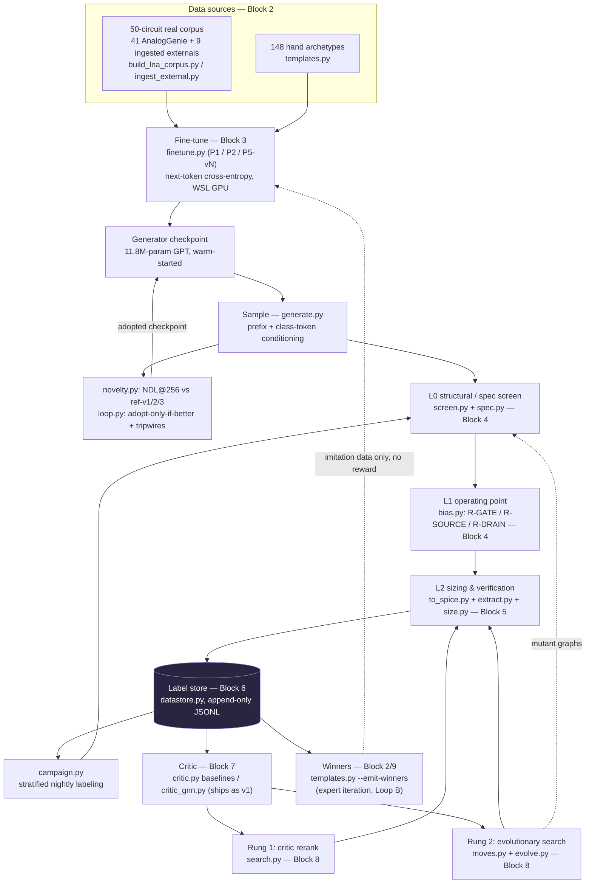
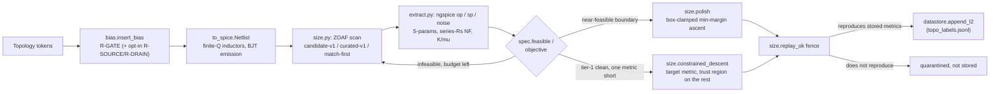

# The LNA Pipeline — Structure & Logic

**What this is.** `JOURNEY.md` tells the story of this project in order — what
happened, who decided it, what it measured. This document does not retell that
story. It is the architecture snapshot: the building blocks that exist *right
now*, how each one is trained or derived (or explicitly not trained at all),
what feeds into what, and the one or two design decisions per block that a new
collaborator would otherwise have to reconstruct from the code. Read this to
answer "how does this machine actually work?"; read `JOURNEY.md` to answer
"how did we get here, and why?"

**Maintenance contract.** Any session that changes a block's mechanism — a new
sizing recipe, a retrained critic architecture, a new search rung, a changed
gate definition — updates the affected block here as part of its wrap-up, the
same commit discipline `JOURNEY.md` and `FINDINGS.md` already carry. Numbers
here are point-in-time; when a number changes, update it and note the
`FINDINGS §N` it came from — don't leave a stale figure standing. This file
does not duplicate `JOURNEY.md`'s chronology or `FINDINGS.md`'s
measurement-by-measurement detail; it points at both rather than restating
them.

**Ground truth.** Every claim below was checked against the code in this
worktree (`lna-data`), cross-referenced against `HANDOVER-EXEC.md` and
`FINDINGS.md` where numbers matter. Where code and prose disagreed, code won —
the one confirmed instance is noted in Block 1.

**Blind-protocol note.** Like every other file in the repo, this document
describes only the allowed spec-number excerpt from the Dhruva target paper
(Kanchetla et al., TMTT 2022) — never its circuit. See `plans2/08-DHRUVA-GOAL.md`
and Block 10.

---

## Dataflow, end to end

Everything downstream of the checkpoint (screen, bias, sizing, storing,
critic, search) is deterministic or classically-trained (ridge/kNN/GNN) code
— none of it is a language model. The only generative, autoregressive model
in the whole system is the Block 3 checkpoint; everything else either
prepares its input, scores its output, or feeds a better version of it back
in as more imitation data. Block 9 states explicitly why none of the feedback
arrows above are reinforcement learning.

---

## 1. Representation & vocabulary

Circuits are token sequences — an Eulerian path over a device-pin graph, the
same scheme AnalogGenie (the external prior-art generator this project warm-
starts from) uses. `lna/genie_common.py` holds the vocabulary: **1005 tokens,
byte-identical to upstream** — device-instance tokens (`NM1..34`, `PM1..34`,
`NPN1..26`, `PNP1..26`, `R1..27`, `C1..15`, `L1..23`, `DIO1..7`, plus digital
cells), each immediately followed in the vocabulary by its own pin tokens
(`NM3_D/G/S/B`, `R5_P/N`, …), and structural tokens for ports/bias nets
(`VIN*`, `VOUT*`, `VDD`, `VSS`, `VB*`, …) plus the `TRUNCATE` sentinel
(`VSS_ID=1003`, `TRUNCATE_ID=1004`).

**Not trained — a frozen, hand-pinned vocabulary.** `lna/test_vocab_matches_upstream.py`
execs the vocabulary-building code sliced out of upstream `Inference.py`,
diffs the resulting device list token-for-token against `genie_common.DEVICES`,
and asserts `VOCAB_SIZE==1005` / `STOI["VSS"]==1003` / `STOI["TRUNCATE"]==1004`.
This is a pure regression guard — one leg of the "regression quartet(+)"
(Block 10) — protecting against silently decoding a checkpoint's output into
the wrong device names.

**The encoding, concretely.** The compressed device-pin graph has two edge
kinds: *wire* edges (real electrical connections) and *membership* edges (a
device token spans between two of its own pins). Upstream's `dfs_all_paths`
finds an Eulerian path starting at `VSS` that covers every edge exactly once —
the walk *is* the token sequence, and decoding just replays adjacency.
`lna/topology.py`'s `Topology(tokens)` reconstructs the circuit by union-find:
an adjacency pair `(a, b)` is a wire edge (unioned into one electrical node)
unless either token is a device instance, in which case it's membership and
ignored for node-building. Sequences right-pad to 1025 tokens with `TRUNCATE`.

`topology.py` also computes two things nothing else in the pipeline
recomputes:

- **The structural LNA score** (`lna_score()`), five criteria derived from the
  real LNA subset's own device statistics (20.3% inductor share in LNAs vs
  0.8% corpus-wide — `FINDINGS §1`): `has_inductor`, `inductor_ratio ≥ 0.10`,
  `has_transistor` (MOS only, not bipolar — a recorded gap, `FINDINGS §19.1`),
  `has_rf_ports` (both `VIN`/`VOUT` nets present), `lna_sized` (2–15 devices).
  It judges nothing electrical — purely "worth simulating."
- **Floating-subcircuit detection** (`floating_devices()` /
  `has_floating_subcircuit`, the H-Q3 mechanism): device-level connected
  components over electrical nodes; a component is "driven" iff it touches a
  reference net (`VDD`/`VSS`/`0` exactly, or a `VB*`/`VCM*`/`VREF*`/`VIN*`/
  `VOUT*`/`IB*`-prefixed net), excluding bias-scaffolding device prefixes
  (`RBIAS`/`CBYP`/`VBGEN`) so inserted bias can never mask a real flag. Used as
  a hard gate in `ingest_external.py` and, opt-in per spec, in
  `spec.structural_screen` (Block 4).

**Design decisions:**

- Keeping AnalogGenie's exact vocabulary and pretrained checkpoint, rather than
  building a new generator from scratch, was the load-bearing Phase-1 call: 41
  LNA graphs is a bad trade against a pretrain over 3,351 circuits on a 4 GB
  GPU (`JOURNEY §2`).
- **Code-vs-doc disagreement, resolved in favor of code.** `topology.py`'s own
  comments cite corpus index 1081 as the motivating example of a genuinely
  floating sub-circuit. `HANDOVER-EXEC.md` (finding #3) corrects this: 1081 is
  fully connected and fails on an *ideal-inductor branch singularity*, fixed
  by giving inductors finite Q (Block 5), not by the floating detector. The
  detector mechanism itself is unaffected and still correctly used for
  generated topologies — only its illustrative code comment is stale.

## 2. Data sources

Three deterministic (non-learned) channels feed the fine-tune corpus.

**The 50-circuit real corpus** (`lna/build_lna_corpus.py`, `lna/ingest_external.py`).
41 circuits reconstructed from AnalogGenie's own dataset (indices 461–492,
1081–1090), run through the same two-stage upstream pipeline
(`SPICE2GRAPH_compress` → `Augmentation.dfs_all_paths`) that produces the
token sequences — one circuit becomes many training rows via multiple
distinct Eulerian traversals of the same graph ("Eulerian augmentation," used
identically for the corpus, the 9 externals, and every `templates.py`
archetype). Plus **9 externally ingested circuits** (IHP SG13G2 tapeouts and a
handful of cited published LNAs) under `lna/data/external/<id>/`, each with
its own `provenance.json`, augmented at a reduced budget ladder. `ingest_external.py`
gates every candidate on: **provenance** (a mechanical re-check of the blind
protocol — scans source/citation JSON for excluded-source markers and
requires an explicit independence statement), **augmentation** coverage,
**structure** (`Topology.valid` + the Block-1 floating detector),
**vocabulary** round-trip, and WL-hash **identity**. Result: 9/9 ingested, 0
quarantined (`FINDINGS §19.2`). Externals are deliberately under-weighted — 18%
of circuits, only 10.7% of training rows, because the reduced augmentation
budget caps how many sequences one external circuit contributes.

**148 hand-built archetypes** (`lna/templates.py`). Constructor families: `cs_lna`
(inductively-degenerated common-source — the narrowband workhorse, with
±gate-inductor / ±degeneration / ±Cex / ±cascode and R / tank / tapped-C
loads, ±output buffer), `cg_lna` (common-gate, inductorless wideband match),
`rfb_lna` (resistive shunt-feedback, inductorless wideband), `cs_cs_lna` /
`current_reuse_lna` (two-stage / current-reuse gain boosters), and four
**`blind-v1`** families added once the Dhruva blind-protocol work started —
`rfb_cs_lna` / `rfb_cs3_lna` (broadband-match-then-tuned-gain, 2/3 stage),
`gmb_cg_lna` (gm-boosted common-gate), `nc_cgcs_lna` (noise-cancelling CG+CS)
— each documented as a generic textbook block chosen from a *measured
failure mode*, explicitly never from the excluded paper (Block 10). Every
archetype is WL-deduped and Eulerian-augmented through the same upstream
pipeline the real corpus uses.

**Winners** (`templates.py --emit-winners`, the expert-iteration channel — Loop
B, Block 9). Pulls feasible + top-quartile near-feasible sized designs
straight from the label store, per-spec, re-Eulerian-augments them,
oversamples feasible rows 2×. "TRUE SPICE numbers only — critic scores never
select training data" (module docstring). This is how a design the pipeline
actually built and verified becomes more imitation-learning data for the next
fine-tune.

**Class tokens `<LNA_NB>` / `<LNA_WB>`** (defined in `finetune.py`, appended
after the 1005 upstream ids) tag every corpus/template/winner row by band
(narrowband = inductor-bearing, wideband = inductorless-tolerant) and select
which class the generator samples from at `generate.py` time.

**Design decisions:**

- `FINDINGS §16`'s template-free control experiment measured that archetypes
  buy structural **yield**, not novelty: removing them drops nb spec-L0 pass
  rate 80.5% → 35.5% while NDL@256 (Block 3) only falls 52 → 42 → 26 — roughly
  half the generator's genuine novelty survives their complete removal
  (`§16.3`, `§16.5`). `templates.py`'s job is teaching the model what a valid
  LNA looks like, not supplying new ideas.
- The nine ingested externals bought **+27 nb / +20 wb NDL@256 (+52%/+95%)**
  from just 5.8% of the training rows — the single largest generator-novelty
  jump measured in the program — and it worked by *displacing archetype
  copying*, not corpus copying (`FINDINGS §24.2–24.4`). It is explicitly
  costed, not free: 11.4 points of screen yield and a wb inductor-ratio
  regression (`JOURNEY`, "Current frontier").

## 3. The generator (LLM)

An **11.8M-parameter**, GPT-style decoder-only Transformer (nanoGPT-style
causal self-attention; `BLOCK_SIZE=1024, N_EMBD=384, N_HEAD=6, N_LAYER=6`),
pretrained upstream by AnalogGenie on its full 3,351-circuit corpus
(`Pretrain.pth`) and **never trained from scratch in this repo** — every arm
below is a warm-start fine-tune.

**Arms** (`lna/finetune.py`):

- **P1** — extends the vocabulary with `<LNA>`/`<OTHER>` class tokens
  (new rows mean-initialized), trains on the 41-circuit corpus tagged `<LNA>`
  + ~22% general-corpus replay tagged `<OTHER>`, samples from `<LNA> VSS` with
  no seed prefix.
- **P2** — same data, bare-`VSS` sampling, no vocab change; the reference
  "plain fine-tune" baseline.
- **P5-vN** — the adopted lineage. Corpus (NB/WB-tagged by inductor count) +
  Eulerian-augmented `templates.py` archetypes + `<OTHER>` replay,
  `<LNA_NB>`/`<LNA_WB>` class tokens. History is additive: v1→v6 grew the
  archetype set 92→118→135→148 and added the `--winners` channel; **v7**
  (current adopted baseline) adds `--external-corpus` (the 9 ingested
  circuits, train-only, so the validation set — and the best-val
  early-stopping criterion — stays byte-identical to v3). `--no-templates`
  and `--warm-from` exist only for controlled experiments (the template-free
  control, `FINDINGS §16`; the curriculum arm, `FINDINGS §18`) and are not
  part of the adopted lineage.

**The training signal, precisely.** Standard next-token cross-entropy
(`F.cross_entropy` over the vocabulary at every position, loss masked after
`TRUNCATE`) on the token stream from Block 1. This is supervised imitation
learning on sequences — corpus circuits, hand archetypes, and past winners are
all just "more text to predict the next token of," differing only in how many
augmented rows of each survive into the mix. **What the training signal is
not: there is no reward, no scalar SPICE outcome fed into a policy-gradient
loss, and no RL loop anywhere in this file.** A winner's only channel into the
model is as an ordinary training row (Block 9 states this precisely for the
whole pipeline, with a grep to back it).

Runs on the WSL GPU (`--device cuda`, AdamW lr 3e-5, batch 32, 40 epochs) — a
4 GB card, hence 128-token padded rows rather than the model's full 1024-token
block. Every arm in the program overfits fast: best-val loss lands at epoch
0–1 and rises monotonically afterward (e.g. P5-v3 0.2300 @ ep 1, ctrl-v1
0.2162 @ ep 0 — `FINDINGS §18.0/§18.3` measured 40 consecutive rising epochs),
so `finetune.py` saves only the best-val checkpoint; the shipped artefact
needs no further epochs.

`lna/generate.py` samples: temperature-scaled multinomial sampling (default
0.7, no top-k/top-p anywhere in the codebase), batched, early-stopping a row
once it emits `TRUNCATE`. Prefix conditioning is either unconditional (`VSS`)
or seeded with the first *N* tokens of a real corpus LNA traversal
(`--prefix lna --prefix-len`); class-token conditioning is handled in
`finetune.py`'s own `sample()`.

**Adoption governance — the frozen NDL@256 protocol.** `lna/novelty.py`
counts Novel Distinct LNAs among 256 generated samples: WL-graph-hashed
(order-invariant over Eulerian reorderings), screen-passing, and absent from a
**versioned, digest-pinned** reference set. The reference has been rebaselined
twice: **ref-v1** (41-circuit corpus only, `5273a4f673b5eb6a`) overstated
novelty once P5 arms trained on archetypes (~51% of screen-passers were
verbatim archetype regenerations scored "novel" — `FINDINGS §14.5`); **ref-v2**
(+148 archetypes → 189 hashes, `b5689490d0285c37`) fixed that; **ref-v3**
(current default; +9 externals → 198 hashes, `d05390da6183123e`, `FINDINGS §19.3`)
measured **exactly zero** correction on every pre-existing checkpoint — proof
the rebaseline is retroactively harmless, only binding for arms trained on the
expanded data. `lna/loop.py` enforces **adopt-only-if-better**: a candidate
checkpoint replaces the baseline only if it beats the frozen NDL@256 at
equal-or-better inductor ratio with every tripwire quiet (Block 9); ties go to
the incumbent. Outcomes: P5-v6 **rejected** (NDL@256 93 vs baseline 100,
`HANDOVER-EXEC.md`); P5-v7 **adopted** (nb NDL 79>52 ✓ at equal-or-better
inductor ratio, even though the wb inductor-ratio clause fails and is reported
rather than hidden — `FINDINGS §24.3`); the curriculum arms **rejected**
outright (`FINDINGS §18.5`).

**Design decisions:**

- P1/P2 both hit a memorization ceiling (median NN-sim to the 41-circuit
  corpus = 1.000) that neither more fine-tuning nor a decoding-time
  inductor-logit bias (P4, `FINDINGS §5`) could break — the fix had to be more
  varied *training data* (P5's archetype corpus), not a better decoder
  (`JOURNEY §2`, `HANDOVER-EXEC.md` finding #8).
- The external-corpus ingestion (P5-v7) is the largest single novelty jump
  measured in the program, and it worked by displacing archetype copying —
  the model does not learn to reproduce the 9 new circuits themselves (0.4%
  copy rate on them) — "variety pressure," not imitation of the new data
  specifically (`FINDINGS §24.4`).
- **Sampling is unconditioned by default and that is a choice, not a
  constraint.** `finetune.sample` seeds with exactly two tokens (class token +
  `VSS`); `lna/_match_sample.py` (`FINDINGS §29.7`) points `generate.py`'s
  Phase-1 real-LNA prefix conditioning at a *fine-tuned* checkpoint for the
  first time, and its unconditioned arm reproduces P5-v7's published protocol
  row on every column. Seeding from existing designs is a near-perfect control
  knob for a targeted structural statistic (source-driven input rate
  **0.032 → 0.192 → 0.760 → 0.926** across arms) and buys **zero** extra novel
  screen-passing candidates, because the additional samples are exact corpus
  copies (corpus copying 32% → 72%, NDL 79 → 10).
- **The novelty law now has three independent confirmations across three
  different channels.** Winners feedback (`§28`, training), row re-weighting
  (`§29.8`, training weights: P5-v9m, **REJECTED**, nb NDL 79→45 for a 1.43×
  motif rate) and prefix conditioning (`§29.7`, decoding) all raise the
  statistic they target and lower NDL. The law is about **where the steering
  signal points** — at structure the model has already memorised — not about
  which channel carries it.
- **★ The generator now has a no-learning control, and it inverts both
  headline metrics** (`lna/grammar_gen.py`, `FINDINGS §31`). A grammar-only
  generator — random device multiset inside the spec's `device_budget`,
  uniformly random wiring (MOS bulk included), serialized through this same
  upstream `build_connection_matrix → dfs_all_paths` path, with well-formedness
  rules limited to what a *decodable, simulable* circuit requires — beats the
  adopted P5-v7 on `wifi24` **spec-L0 (65.6% vs 65.2%)** and on **NDL@256
  (168 vs 63)**, because a random graph is never a copy of anything. The
  separation appears only at the first stage that runs a simulator: after
  `bias.insert_bias`, **3.0% of the grammar arm's screen-passing samples have
  all MOS conducting against P5-v7's 67.7%**, the median random circuit has
  **zero** conducting transistors, and at equal sizing budget the no-learning
  arms return 0 near-feasible designs where P5-v7 returns 2 plus one audited
  `wifi24` tier-2 feasible. **What this block's training buys is DC viability
  and gain capability — not novelty (a random graph is more novel) and not
  structural plausibility (a random graph passes the same screen).** The
  consequence for governance is stated in Block 10 and in `JOURNEY`'s current
  frontier: NDL measures *not-copying* and has never measured *working*.
- **The source-driven input motif is abundant in graph space and scarce only
  in the data** (`FINDINGS §31.4`). Random wiring emits it at **48.4%**; the
  adopted generator at **14.4%**. `§29.6` inferred that from the training mix
  (the archetype channel is 98.6% gate-driven); this is the same conclusion
  measured from the opposite side, and it is why the three steering levers
  (`§28`, `§29.7`, `§29.8`) could only trade novelty for rate — they pointed at
  memorised structure, and the structure the mix is missing is not there to
  point at.

## 4. The evaluation ladder

**Not trained — a fixed, three-rung deterministic screen.** Every design
clears L0 before it's worth simulating, gets rule-based bias before an
operating point exists (L1), and is only fully scored once sized (L2, Block 5).

**L0 — structural / spec screen** (`lna/screen.py`, `lna/spec.py`). A spec (a
YAML file in `lna/specs/`) is the single source of truth for what's being
designed; `Spec.structural_screen(topo)` **derives** its L0 criteria from the
spec's own `topology:` fields, rather than running one hand-written screen
against every target (the old hard-coded 5-criterion screen survives only as
`legacy-lna5`, reproducing the historical 59.4% ceiling exactly). Concretely,
`wifi24.yaml`: `device_budget: [3, 16]` (widened from `[3, 12]` after
calibration showed real single-ended corpus LNAs reach 14 devices),
`max_inductors: 3`, `l_min`/`l_max` bounds, `allow_inductorless: false` →
activates `has_inductor`; `reject_floating: true` activates the H-Q3
floating-subcircuit check. For inductorless-allowed (wideband) specs, a
`match_plausible` check substitutes for `has_inductor` — structurally
detecting a common-gate or resistive-shunt-feedback input stage, rather than
accepting any transistor+resistor tangle.

A spec's `constraints:` block separates **gated** (checked pass/fail, e.g.
`s11_db: {max: -10}`) from **`status: unsupported`** (declared but never
measured — e.g. `iip3_dbm` on every spec today, pending a two-tone harness;
reported as UNMEASURED everywhere, never silently passed *or* failed). There
is no separate third "advisory" constraint state inside `spec.py` itself:
metrics that are measured but not gated (e.g. two-port stability K/μ, Block 5)
simply live outside `constraints:` and are reported alongside without
affecting `feasible()`. `spec.objective()` blends hard/soft feasibility-first:
an infeasible design scores `1 + Σ(normalized violation)` — always worse than
any feasible design — a feasible one scores by weighted normalized
improvement on the declared `objectives:` (e.g. maximize S21, minimize
Idd/NF).

**L1 — operating point** (`lna/bias.py`). Not trained — rule-based. Real
dataset LNAs are textbook schematics with implied biasing; a reconstructed
gate often has no DC path and the device sits off. `BiasInserter` runs
union-find over the DC-connectivity graph (R and L are DC edges, caps open, a
MOS channel is not) and applies:

- **R-GATE** (always on) — every MOS gate with no DC path to a driven net
  (`VDD`/`VB*`/`VCM*`/`VREF*`/`IB*`) gets a resistor to a fresh bias source
  plus a bypass cap.
- **R-SOURCE** / **R-DRAIN** (v3, opt-in — `--rules v3` /
  `LNA_BIAS_RULES=source,drain`) — a source or drain with no DC return gets a
  resistor to its device's return rail (NMOS source→0 / PMOS source→VDD;
  opposite for drain, i.e. a load feed). Added after measurement showed the
  corpus's off-MOS split was 15 source-no-DC-path / 16 drain-no-DC-path / 12
  load-sizing (`HANDOVER-EXEC.md` finding #9) and that gate-only rescue fixed
  **0 of 4** blocked external circuits, because every one of those devices'
  problem was a source with no return, not a gate (`FINDINGS §17.6`). Off by
  default because a source-return resistor is a real signal-path element, not
  scaffolding — turning it on would silently re-domain every future sizing
  label.
- **The monotonic guard** — candidates are evaluated as a ladder (none → gate
  → gate+source → gate+source+drain) and the best-so-far kept under "strictly
  more conducting MOS," so no rule set can ever be adopted for a circuit that
  makes conduction *worse*.

**Design decisions:**

- The spec-driven L0 (replacing one hard-coded screen) resolved H-Q4: the old
  screen's 59.4% "ceiling" on most of the corpus was an artefact of forcing
  every circuit through one narrowband-MOS-specific rubric — union coverage
  over the in-scope single-ended-MOS class is **94.1%** (`HANDOVER-EXEC.md`
  finding #2).
- `device_budget` widenings are always corpus-calibrated to the nearest real
  silicon device count, never to "the number that closes a gate" — `[3,12] →
  [3,16]` from the 41-circuit corpus, then `16→18→21` on the dhruva specs
  only, each widening citing the specific real circuit that justified the new
  ceiling (`FINDINGS §23.1`, `§25.3`) — and the record says so even when the
  grant exceeds what was actually used (21 approved, 20 needed, `§25.3`).

## 5. Sizing & verification

**Not trained — a deterministic optimization + measurement stack** that turns
a bias-inserted topology into a scored, verified design point (L2).

`lna/to_spice.py` (`Netlist`) emits a parameterized SPICE deck: every device
value is a `.param`; inductors are ideal by default or given a **finite Q**
(`inductor_q`, series R = ω₀L/Q at band centre) to avoid the ideal-inductor
branch singularity that Block 1's "1081" case turned out to actually be;
MOSFETs are emitted **multi-finger** — ` NF={max(1,ceil(W/w_finger))}` with
`w_finger = 2 µm` — because BSIM4 charges a real gate-electrode resistance
(`rgatemod=1`, `rshg=0.4 Ω/sq`, `ngcon=1`) that scales as 1/NF, and emitting the
single-finger default put **26–40% of the excess noise factor** into gate
resistance on every design measured (`FINDINGS §26`). 2 µm/finger is ordinary RF
layout practice, calibrated to that practice and not to any target;
`w_finger=None` reproduces the historical single-finger deck byte-for-byte.
Geometry is a **label domain**: `w_finger`/`mos_fingers` are stamped onto every
logged row beside `inductor_q` and `nf_method`, and the store-wide relabel onto
the new emission moved NF by a **median of −2.08 dB** over 1240 rows
(`FINDINGS §27`), so pre- and post-cutover NF must never be pooled;
bipolar devices are emitted as SPICE `Q` elements against golden-checked
generic Gummel-Poon cards (`ref/check_bjt.py`), added once real ingested
circuits (IHP's `GPS_LNA`) brought bipolar devices into the corpus.

`lna/extract.py` is the **single ngspice entry point**. Every call runs inside
a **self-deleting scratch directory** (`scratch()`, wrapping `tempfile.mkdtemp`
+ `shutil.rmtree` on exit) — added after a stale-directory bug left **685,287**
uncollected scratch directories in `%TEMP%` from earlier callers that
`mkdtemp`'d without cleanup (`FINDINGS §17.9`). It extracts:

- **S-parameters** and the derived **Rollett stability figures** (K, |Δ|, μ,
  μ_src at f0 and worst-in-band) — computed for free from the S-matrix `sp`
  already runs; advisory only, never gated.
- **Noise figure**, via a **series-Rs deck** (`measure_nf` / `build_noise_deck`).
  The S-parameter port's z0 is not a noisy source resistor, so the original
  port-referred `inoise_spectrum` reading went **negative** once a stage had
  gain. The fix swaps the port-1 source for an explicit `Rns = 50 Ω` and reads
  `NF = 10·log10(inoise² / 4kTRs)`; golden-locked at `extract.py --selftest`
  to **3.012469 dB vs the analytic 3.0103 dB**. Rows measured before this fix
  carry a different `nf_method` and are never used as an NF training target
  (Block 6).
- **The operating point**, passively (`op_probe_lines` / `parse_op` /
  `mos_region`, WP-OBSERVE). Every evaluation already solves a full DC operating
  point; until Session 7 the extractor ran `op` and kept one scalar out of it
  (`idd`). It now reads back per-device `id/gm/gds/gmbs/vgs/vds/vbs/vth/vdsat`
  (+ a derived region) for MOSFETs and `ic/ib/vbe/vbc/gm/cpi/cmu` for bipolars,
  plus node voltages and source branch currents. The mechanism is **`print`
  lines and nothing else** — spliced between the existing `print idd` and the
  existing `sp`, with **no `save`** (gotcha N1: a `save` before `sp` restricts
  ngspice's saved set and silently deletes the S-parameters) and **no extra
  ngspice invocation**. `ref/check_op.py` is the golden: captured Id/gm against
  an independent bare-`op` probe (relative error **0.0e+00**), the metric vector
  bit-identical with the probe present and absent (**18 of 18** at `repr`
  precision), and the first numerical test of the standing claim that the
  series-Rs noise deck shares the sizing deck's DC solution (**0.0e+00**) —
  which is what lets `size.log_l2_result` harvest an operating point from the NF
  deck it was already running. Measured cost is below this machine's noise floor
  (`FINDINGS §30.2`): end-to-end sizing runs come out at −0.8% / −0.7%.

`lna/size.py` runs **ZOAF**, a zeroth-order (gradient-free) black-box
optimizer (`misc/ZOAF`), over the `.param` surface in `[0,1]^d` (log-scale for
W/R/C/L, linear for bias), maximizing `-spec.objective`. Three sizing recipes:

- **`candidate-v1`** (all-free) — every sizable parameter free; reliably lands
  gain *or* match on anything but the simplest topologies, not both.
- **`curated-v1`** (`curate=True`) — the input-match passives are fixed at a
  prior best value (`_curate`) and only the rest is sized: the reliable path
  to a first feasible point once *some* prior solution exists.
- **match-fixed / self-starting** (`size_match_first`) — the curated idea
  without needing a prior solution: solves the match first, then sizes the
  rest.

Two boundary-refinement passes operate on an already-sized point:
`polish()` (box-clamped coordinate pattern search maximizing the *minimum*
normalized margin over every gated constraint — the right move at a
feasibility boundary, since it has a gradient right at the edge where the
feasibility-first scalar does not) and `constrained_descent()` (optimizes one
target metric, e.g. NF, inside a hard trust region on every other gated
constraint — the right move once a design is already tier-1-clean and needs
to spend slack on exactly one binding constraint, which `polish` cannot do
because it values a large non-binding surplus at exactly zero). Both are
**box-clamped** against the spec's declared device ranges — added after Track
B found `polish` walking parameters outside the spec's declared box (6 of 19
feasible rows were out-of-box before the fix; all 5 non-Track-B rows returned
feasible and in-box after clamping, one tier-2 claim honestly died —
`FINDINGS §13.3`).

`size.replay_ok(topo, params, spec, stored_metrics)` is the **audit fence**:
re-run the exact stored `(topology, params)` pair from scratch and require the
S21/S11 it reproduces to match the stored metrics within label noise (S21
within `max(σ, 0.5)` dB, S11 within 2.0 dB). Any stored claim that fails this
is quarantined, not trusted (Block 10).

`lna/g4_search.py` runs boosted multi-seed sizing on the handful of
closest-to-feasible candidates from a generator pool: a larger ZOAF budget
across several fresh seeds (ZOAF is stochastic; different seeds explore
different basins), **polish-first** from each candidate's stored best point
before falling back to a fresh ZOAF pass — a ~100-sim `polish` converts most
boundary near-misses cheaply, and full re-sizing is spent only on what polish
can't close. This is how Gate G4 (first novel *generated* topology sized to
full feasibility) closed: `seq0240`, an 8-device generated topology, went from
infeasible to S11 −11.9 / S21 12.6 / Idd 1.19 dB feasible purely from more
seeds/budget on the same topology (`FINDINGS §11`, "GATE G4 CLOSED BY
GENERATION").

**Design decisions:**

- **Observation is free; discarding it is the expensive choice.** The op
  read-out was added on exactly the argument that produced Block 6 in the first
  place — the simulation had already been paid for. `size.OpSink` holds the
  whole volume policy so no driver can drift from it: the final/best point of
  every sizing run is always captured, a repeat probe captures every evaluation
  (`LNA_OP_SUBSAMPLE_PROBE`, default 1), ordinary inner ZOAF points are sampled
  1-in-8 (`LNA_OP_SUBSAMPLE`), and `LNA_OP_LOG=0` disables it. Sampling is
  deterministic by call index, never random, so the same seed produces the same
  table. `polish` and `constrained_descent` inner loops are deliberately NOT
  hooked; their endpoints are covered through `log_l2_result`.
- The NF-harness rewrite (series-Rs, not port-referred) is the single most
  consequential correction in the eval ladder: the old method flattered every
  design by +0.55…+12.58 dB (median +2.32), including two designs that read
  physically impossible *negative* noise figures (`FINDINGS §13.1`).
- `polish` and `constrained_descent` are not redundant: `FINDINGS §17.1/§23.2`
  measured that min-margin polish literally cannot spend a large non-binding
  surplus, which is exactly why the third-stage NF win on `dhruva-s`
  (Gate D3, `FINDINGS §25`) needed the target-metric descent instead.
- **Device geometry is part of the measurement, not a detail.** The
  single-finger emission did not just overstate NF; it was a large real series
  loss that *guaranteed* port passivity, and removing it exposed the Gate-D1/D2
  4-band archetype as only conditionally stable on `dhruva-l2` (K_min +10.15 →
  −17.2, with |S12·S21| flat, i.e. a port reflection coefficient exceeding
  unity — `FINDINGS §27.5`). Stability counts taken through the old harness are
  **lower bounds** and deserve a re-audit.

## 6. The label store

**Not trained** — an append-only JSONL store (`lna/datastore.py`) that is "the
product" every learned component (Block 7) trains against. Four tables —
`topo_labels.jsonl` (L2, one sizing outcome per (topology, spec), the
expensive prize), `l1_labels.jsonl` (L1, cheap operating-point sweeps),
`sim_points.jsonl` (point rows inside a ZOAF run, gitignored),
`op_points.jsonl` (op rows — the *inside* of an evaluation, gitignored) — plus a
`snapshots.json` index that pins named training sets by exact line count +
sha256, so `load(table, snapshot=name)` always returns exactly the rows a
critic version trained on, and any post-hoc mutation is detected as a hash
mismatch rather than silently served.

An **op row** (`row_op`, WP-OBSERVE) is what a point row would be if it had not
thrown away everything but the metric vector: per-device operating point, node
voltages, source branch currents, a region census, and — when one had already
been computed for that point — the per-element noise budget, attached by reuse
and never re-measured. It is stamped like a `sim_points` row (`wl_hash`, `spec`,
`x`) plus the decoded `params` (an `x` is meaningless without the `kind_ranges`
box that decoded it) plus a `harness` block carrying `recipe`, `w_finger` /
`mos_fingers`, `inductor_q`, `nf_method`, `nf_gated`, `bias_rules`, `op_schema`
and `deck` — the last being *which* of the two decks the op came from, so the
sizing-deck and noise-deck populations stay separable even if a future harness
change breaks the DC equality `FINDINGS §30.1` measured. It is in no snapshot:
it is a byproduct table, and whoever first trains on it pins one then.

Every L2 row carries `margins` (`margins_for`, `spec.feasible()` re-expressed
as a per-metric signed normalized slack — the actual learning target, never a
feasibility boolean) and a `recipe`/`provenance` pair that acts as a
**label-domain separator**: rows produced under a different NF method
(`nf_method`), a different `zoaf_cfg.nf_gated` state, a different sizing
recipe (`candidate-v1` vs `curated-v1` vs `candidate-v1+bo3` vs
`blind-v1`/`blind-v1-nf` vs the `nf-v2+d18`/`nf-v3+d21` device-budget
domains), or a different bias-rule ladder are never silently pooled for
training, ranking, or noise estimation — a rule violated once
(`campaign.sigma_key` used to group repeat-probes by `(wl_hash, spec)` alone,
mixing 81 of 89 multi-row keys across recipes) and fixed to condition on
`(wl_hash, spec, recipe, nf_gated)` (`FINDINGS §14.1`).

**Family splits** (`datastore.family_split`) assign whole single-linkage
clusters of WL-cosine-similar rows (threshold 0.9 — the same "same topology
family" definition search's trust region uses, Block 8) to train/val/test as
a unit, never a row-level random split, because the corpus is dense with
near-duplicates and a row split would leak the answer across the boundary.

**σ / repeat-probes.** `campaign.py`'s `run_sigma_probe` re-sizes the same
(topology, spec) key with fresh seeds to measure ZOAF's own label noise — the
floor every critic rank-loss margin is measured against. The historical
number (σ(S21) ≈ 0.32 dB, apparently drifting to 1.02/1.27) turned out to be
mostly the recipe-pooling bug above plus an n=2 stdev estimate; re-measured
cleanly at 9 seeds/key, σ_single = **1.478 dB**, and **best-of-3 labeling**
(`size.size_best_of_k`, recipe `candidate-v1+bo3`) roughly halves it to
**σ = 0.726 dB** (`FINDINGS §14.1`) — still short of the ≲0.5 dB target, so σ
is reported and conditioned on, never assumed small.

`lna/campaign.py` is the nightly labeling scheduler: a stratified quota
across four sources — **T** (templates/reference decks, topology diversity +
near-feasible class), **G** (generated, screen-passing and WL-deduped against
the store), **M** (mutations — reserved for `moves.py`'s move set, but the
quota slot is currently a documented placeholder: `campaign.py` itself notes
"M awaits the mutation move set" and does not call `moves.py`; `evolve.py`
produces and logs mutation-derived labels through its own path, Block 8,
independent of this scheduler), **R** (repeat-probes) — sizing each task once
and writing a morning report (`lna/data/reports/`).

**Design decisions:**

- Recipe/provenance-as-label-domain is the single mechanism protecting every
  downstream number (critic training, σ, novelty accounting) from silently
  mixing incompatible measurements — the same discipline applied at five
  separate junctures (NF method, NF gating, device budget, sizing recipe, and
  now the op read-out's `op_schema`) rather than one central flag, because each
  domain break happened at a different session and had to be caught after the
  fact.
- **Every table's growth is budgeted against the table before it.** `op_points`
  rows are ~2.65 kB against `sim_points`' measured 377 B, so the 1-in-8 default
  inner-sampling rate is set so the new table grows *more slowly* (≈331 B per
  ngspice evaluation) than the one it rides along with — a logging feature that
  becomes the largest thing in `lna/data/` is a logging feature the next session
  turns off.
- Family splits (not row splits) are what makes the critic's "family holdout"
  number meaningful at all; the same near-duplicate-dense corpus property
  that makes row splits leak is what makes WL-kNN "embarrassingly strong" as
  a baseline (Block 7).

## 7. The critic

A learned pre-SPICE surrogate: predicts the normalized margin vector
(S11/S21/Idd, +NF once available) a topology would achieve against a spec, so
search can filter candidates before spending a 5-minute sizing run on each.
Feasibility is always *computed* from predicted margins, never a trained
boolean.

`lna/critic.py` — the mandatory baselines, on the torch-free stack:
**trivial** (predict the training mean), **WL-kNN** (nearest training
neighbor by WL-subtree-kernel cosine, spec-conditioned), **ridge**
(L2-regularized linear regression on hand features: graph stats + device-node
degrees + a spec-conditioning vector of thresholds/band + a WL-subtree
bag-of-features vocabulary built from train only). `lna/critic_gnn.py` — the
shipped model: a **hand-rolled bipartite device↔net message-passing network**
(plain `torch.nn`, no PyG/DGL — graphs are tiny enough that dense per-role
adjacency matmuls beat any sparse library), 3 message-passing rounds, sum+max
device pooling, the spec vector concatenated at the readout, one head
predicting S11/S21/Idd/**NF margins** (NF masked out on pre-harness rows).
Trained with Huber loss on margins + a pairwise rank-hinge on S21 (hinge
margin set from the repeat-probe σ — never fit finer than label noise). A
**5-seed deep ensemble** gives mean prediction + std; the std is what
`search.py`'s `mean − β·σ` selection rule (Block 8) consumes as uncertainty.

Training data: named, sha256-pinned snapshots of the label store — `v1-train`
→ `v2-train` (261 rows) → `v4-train` (734 rows) → `v5-train` (1010 rows) —
each retrain re-measured on the same frozen splits so improvement is
attributable to the data, not a code change (verified explicitly at least
once: the same code on the old `v2-train` snapshot reproduces the old numbers
exactly — `FINDINGS §14.2`).

**Eval protocol**, three splits: **family holdout** (whole WL-similarity
families withheld — the primary gate); **source-shift** (train on
corpus+references+templates, test on every generator/search-produced row —
the shift search-guided sampling actually induces); **mutant**
(`critic_gnn.py --mutant-eval`, post-hoc scoring of `evolve.py`'s one-edit
graph mutants under leak-free family cross-validation — the off-distribution
test that revealed the critic's real deployment behavior, Block 8).

**Gate C1, restated 2026-08-09** (`critic.c1_pass`): **ρ(S21) ≥ 0.5** on
family holdout, **and** selection **skill ≥ 0.25**, where
`skill = (precision@20% − base_rate) / (ceiling_precision − base_rate)` — 0
for random selection, 1 for a perfect ranker, at *any* base rate. This
replaced the original "enrichment@20% ≥ 2×" bar after `FINDINGS §14.2/§14.6`
proved its ceiling is `min(1/0.2, 1/base_rate)`, which *fell* from 3.74× to
2.20× as the candidate pool got better — the gate was getting harder exactly
because the pipeline was improving, which is backwards. θ = 0.25 is derived,
not tuned: the unique constant reproducing the old bar's meaning everywhere it
was well-posed.

Current state (`v4-train`/`v5-train`, σ = 0.726–0.783 dB best-of-3): **the
GNN ships as critic v1** — family-holdout ρ(S21) **0.851** (vs ridge 0.790,
WL-kNN 0.687), source-shift ρ(S21) **0.609** (vs 0.585, 0.370) — not a clean
sweep (ridge ties or beats it on some source-shift metrics), but uniquely the
only arm with usable ensemble uncertainty (ρ(σ,|error|) ≈ 0.53–0.54).

**Known limits:**

- **Off-distribution decay.** In-distribution ρ ≈ 0.83 collapses to ρ ≈
  +0.17…+0.20 on the mutant distribution `evolve.py` actually generates
  (`FINDINGS §15.4`) — a coverage problem (the two search specs had only
  16–24 training rows each), not a modeling one. The mutant post-hoc, after
  search added 213 rows on exactly those specs, recovered to ρ ≈ +0.44…+0.50
  under leak-free CV — real but partial (`FINDINGS §20.2`).
- **The retired σ-gate.** The uncertainty-based trust rule (reject a candidate
  above the 90th-percentile holdout σ) never fired across 80 generations of
  live search — ensemble σ on off-distribution mutants is systematically
  *smaller* than in-distribution holdout σ, the opposite of what the gate
  assumes, because mutants are one-edit perturbations of well-covered graphs
  rather than structurally unusual held-out families. Retired in favor of the
  WL-cosine trust region, which measurably does the real filtering
  (`FINDINGS §20.3`).

**Design decisions:**

- The GNN was tried and *lost* the gate to WL-kNN on an earlier snapshot
  (`v2-train`) before winning on `v4-train` — the brief's preference for a
  GNN was honored only once the data justified it, not by default
  (`FINDINGS §11`).
- A silent bug (`_margins` reading only `s11_db`) dropped every broadband-spec
  row (dhruva-*, wideband-sdr — ~240 rows, the whole Track-B corpus) from
  every critic trained before it was found and fixed; the source-shift
  ρ(S21) jump from 0.221→0.585 on the very next retrain is mostly the data
  becoming visible, not a modeling change (`FINDINGS §14.2`).

## 7b. The point surrogate (WP-SURROGATE v0)

Block 7's critic scores a **topology**; this scores a **point inside one**.

`lna/surrogate.py` — a learned stand-in for one ngspice call:
**f(topology graph, parameter vector x) -> the 7-metric vector**. Where the
critic asks "is this topology worth a sizing run?", this asks "is this
*evaluation* worth making?", which makes it an inner-loop instrument rather than
a candidate filter. Its output is not a ranking, it is **SPICE-minutes**.

**What it is trained on.** `data/sim_points.jsonl` — the point rows
`size._log_l2` has been appending as a free byproduct of every ZOAF run since the
store went live, gitignored and, until this WP, never used for learning (66k
rows against `topo_labels`' 2.8k). A point row carries only `(wl_hash, spec, x,
metrics)`, so the join is reconstructed and then *proved*:

* runs come from **append order** (a run's points are one contiguous
  `ds.append_all` burst); the L2 row is matched on `(wl_hash, spec, n_evals)`,
  which is what disambiguates a topology sized more than once;
* the parameter map is rebuilt with `size.py`'s own machinery
  (`prepared_body` / `classify_params` / `kind_ranges` / `match_devices`) and
  every block must decode its L2 row's `best_x` into its `best_params`
  **string for string** or it is dropped (333/336 pass);
* eight interior points replayed through ngspice reproduce every stored metric
  to **0.000000** under `w_finger=None`. Coverage **98.85%** (FINDINGS §33.1).

**Architecture.** `critic_gnn.MPNN`'s bipartite device<->net trunk, imported
verbatim (not copied, not edited), with a new input embedding and readout. The
parameter vector is **per-topology in length**, and the design decision that
carries the block is to inject each parameter **at the device node it belongs
to** — `p<dev>W` into that MOS, `p<dev>V` into that passive, `pVBG<k>` into the
MOS gates its bias net drives. Variable length is dissolved rather than padded
around, and the encoder stays permutation-equivariant. Measured against the
alternatives on cold-start rho(S21): node **0.821** / FiLM 0.818 / pad-and-concat
0.646 — *where* a parameter enters matters, *how often* it re-enters does not.
Splits are `datastore.family_split` over the joined topologies, never row-level.

**What it is NOT valid for — the era wall.** `sim_points.jsonl` is live, so v0 is
pinned to a prefix by line count + sha256 (66,664 lines,
`591428b0fcadc458...`) *and* per-block by recipe and date. Every training row is
**2026-08-06/07, `wifi24`, `candidate-v1`/`curated-v1`, `nf_gated=false`** —
i.e. **pre-`mf2-v1`** (single-finger MOS, Block 5's current emission is
multi-finger; the same points move up to 10.2 dB through today's deck) and
**pre-`nfrs-v1`**, so its **`nf_db` head is the RETIRED port-referred NF** and
must never be pooled with or substituted for a `series_rs` NF. v0 is a proof of
mechanism; a production surrogate needs the post-cutover points Block 6 is now
accumulating.

**The result that matters.** Replaying all 333 stored ZOAF runs with the
surrogate as a pre-gate (zero new SPICE) shows an **oracle** gate would skip
**82.6%** of a cold-start run's ngspice calls and **90.1%** of a warm-start
run's with the argmin exactly preserved — i.e. roughly four of every five
evaluations this pipeline has ever spent inside ZOAF were waste. v0 captures
**42.9% at zero argmin change on the warm-start stratum** (the one
`size_best_of_k` already creates every time it re-sizes with seeds 2 and 3) and
only ~1% cold-start; at the pre-registered margin it skips 62.8% cold-start but
moves 39% of runs off their argmin. The gate is **margin-limited by the
surrogate's own point error**, so it improves with data rather than with
architecture (FINDINGS §33.5).

**Design decisions:**

- The join is *proved* rather than trusted, because a silently mis-ordered
  parameter map would have produced a plausible-looking model trained on
  scrambled inputs — the same failure mode as the `_margins` bug in Block 7,
  which cost ~240 rows before anyone noticed.
- The gate always **computes** feasibility from predicted metrics and never
  regresses the objective, matching Block 7's rule.
- The oracle arm is reported first: without it, "62.8% skipped" reads as a model
  result when most of it is a property of the search.

## 8. Search

Two "rungs" that spend SPICE minutes more efficiently than random sizing, by
consulting the critic (Block 7) before deciding what to size.

**Rung 1 — critic rerank** (`lna/search.py`). Given a fresh pool of generated
candidates: L0-screen, WL-dedup, drop anything already sized against the
target spec; train a leak-free critic-v2 GNN ensemble (every store row
sharing a pool candidate's WL hash is dropped from training first); score
`mean − β·σ` (β=1) over the four margin heads; size the union of {critic's
top-k} ∪ {k seeded-random control picks} once each (shared picks credited to
both arms, so the comparison stays equal-budget). Live on `dhruva-s`
(`FINDINGS §20.4`): 110 fresh candidates, k=30/arm, only 54 of 110 (49%) ever
touch SPICE — critic arm **15/30 near-feasible** vs control **8/30** (1.88×,
literal ≥2× bar **not met** by one design, but the restated skill bar
**0.328 ≥ 0.25 is met**), with the critic's edge concentrated on NF (3 vs 9
violations) — the constraint the whole dhruva ladder is stuck on.

**Rung 2 — evolutionary search over graph edits** (`lna/moves.py` +
`lna/evolve.py`), a **genetic algorithm, not a learned policy**. `moves.py`
defines **17 one-edit mutations** on the same netlist form `templates.py`
uses — `load_swap`, `cascode_add`/`remove`, `buffer_add`/`remove`,
`degen_add`/`remove`, `stage_add`/`remove`, `feedback_add`/`remove`,
`match_elem_add`, `input_class_swap`, `passive_type_swap`, `rewire`,
`device_remove`, `aux_path_add` — each realized through the full round-trip
(netlist → tokens → `Topology` → L0 screen → WL hash) so genotype and
phenotype can never drift apart, plus a stage-boundary crossover that splices
two parents at an interstage-coupler seam. `evolve.py` runs a
population/generations loop (default pop 48, gens 20) with three trust
mechanisms guarding the critic's off-distribution weakness: **(1)** selection
always uses `mean − β·σ`, never the raw mean; **(2)** an uncertainty gate
(retired, Block 7); **(3)** a **trust region** — an offspring farther than
WL-cosine 0.9 from every labeled row is "untrusted" and routed to a dedicated
exploration stratum (25% of the population, its own true-eval slot) rather
than discarded; **(4)** only true SPICE numbers are ever logged as results.
Each generation, only the top 2 trusted elites + 1 exploration individual get
a real sizing run (`bias.insert_bias` → ZOAF scan → box-clamped polish); the
rest of the population (up to 96 individuals) is scored by the critic only.
Neither `search.py` nor `evolve.py` writes the store directly — both call
`size.log_l2_result` / `size.size_topology`'s internal logging, which appends
through `datastore.append_l2`.

Measured results (`FINDINGS §15`): a dead heat on `wideband-sdr` (critic
guidance bought nothing — the same off-distribution collapse Block 7
measures), and a clear win on `dhruva-s` (**87% near-feasible vs 47% control**,
and the search-only design `8c7592ea859e489a` — a search-rearranged
noise-cancelling CG+CS descendant, no generator sample involved — improved
the best tier-1-feasible NF on that spec from 8.88 to 5.58 dB).

**Design decision worth carrying:** the trust region did real, measurable
work (kept ≥24/32 trusted slots filled every generation on both specs; the
unguided control drifted to as few as 1/32 trusted by run's end) while the
uncertainty gate never fired once in 80 generations — a case where the
cheaper, simpler guard (distance-to-training-data) outperformed the fancier
one (learned uncertainty) (`FINDINGS §15.4`, `§20.3`).

**Rung 0 — candidate selection, added `FINDINGS §29`.** Before either rung
spends a SPICE second, *which* pool candidates get sized is itself a lever, and
it turned out to be the decisive one on the match question.
`nf_campaign.py`'s `pool:` source ranks by **least** WL-similarity to the
`nccgcs`/`gmbcg`/`rfb` families; §27.6 used it, drew 12, found nothing viable,
and recorded a capability negative. `lna/_match_struct.py` is a structural
instrument (graph arithmetic over `Topology.nodes` — elements at the VIN node,
hops to the first active terminal, which terminal, source degeneration, feedback
to a drain; **no impedance, no formula**) whose `port_src` predicate was measured
on 828 stored designs to carry the whole match/no-match split
(P(match|source) **0.581** vs P(match|gate-only) **0.132**). Selecting the same
pools by that predicate instead — 29 distinct graphs — gave **24/29 band-matched
and one full Gate-D3 feasible `dhruva-l5` design whose topology is the
generator's** (`80aaf9f4`, NF 1.788, audited). The `input_class_swap` move
(already in the 17) is the controlled version: applied to the two designs §27.6
named, **both** closed the match, and one reached Gate D3 in two edits
(`78f5cc9c`, NF 1.963). **Consequence for the record: a capability negative in
this program is only as strong as the selector that produced its candidates, and
must name it.**

## 9. The loops

The governance layer that decides whether a checkpoint or a search run should
feed forward — and the honest statement that **none of this is
policy-gradient reinforcement learning**. A grep for
`reward|policy_gradient|RL|PPO|REINFORCE|Q-learning|advantage` across every
`lna/*.py` file returns zero hits in any RL sense (the only "reward"-adjacent
string is the sizer's unrelated feasibility-violation scalar).

The two mechanisms that could be mistaken for RL are both something else:

- **Loop B — expert iteration** (`templates.py --emit-winners` →
  `finetune.py --arm p5 --do both --winners`). A "winner" is selected purely
  by its already-realized SPICE objective (`spec.objective`, top-quartile
  feasible/near-feasible), then folded into the *next fine-tune's ordinary
  training set* as more sequences to imitate via next-token cross-entropy
  (Block 3). No reward, no advantage estimate, no gradient through a sampling
  decision — this is supervised learning on curated examples, the
  imitation-learning half of "self-improvement," not reinforcement.
- **Rung-2 evolutionary search** (Block 8) is a genetic algorithm operating
  directly on circuit graphs — mutation + fitness-based selection. Nothing
  about the search process trains a policy; the critic it consults is a
  static, separately-trained (offline, supervised) ranking model, read-only
  during selection. The only way search feedback re-enters learning is
  indirect and non-RL: SPICE labels it produces get folded into the critic's
  next offline retrain (ordinary supervised regression) and into Loop B's
  winners file (ordinary imitation data) — never a reward term in anyone's
  loss.

`lna/loop.py` is the governance layer proper — not itself a learned
component. It reads/writes `lna/data/loop_state.json` and defines:
**tripwires** (5 numeric monitors — NDL drop >20% vs the pinned baseline,
distinct-WL-family count <50% of baseline, repeat-probe σ drift >2×, labeled
feasible-rate >0.60 (margins compressing), plus a critic-holdout regression
check folded into adopt-only-if-better) with a named response per trip (e.g.
revert checkpoint, raise replay fraction); the **SPICE-minutes-per-feasible-
novel-design curve** (`spice_curve()`, `total sim seconds / distinct
feasible-and-novel WL hashes`) — the program's own cost-efficiency yardstick,
which dropped **967 → 367 → 187 SPICE-min** across the program's first four
iterations as feasible-novel designs rose 1 → 3 → 6; and **iteration gating**
(`cmd_iterate`, exit code 0 only when tripwires are quiet) — the documented
exit criterion is two consecutive iterations with the curve improving and
every tripwire quiet, not yet formally called.

`lna/benchmark.py` is the cross-spec scoreboard: sizes the feasible/
near-feasible candidate record against every spec, tier-1 (S11/S21/Idd) and
tier-2 (+NF) gated at the same sized point, writing
`lna/data/benchmark.md`/`.json`. **The `--specs` subset trap** (`FINDINGS §25.6`):
`write_report()` rebuilds the *entire* committed table from only the
`spec_names` list of the current invocation — there is no merge with what's
already on disk. An invocation that named only two specs (a legitimate,
independent Gate-D3 confirmation) silently dropped the other five specs' rows
from the shared file; it had to be manually reverted, with the numbers
salvaged from the run's own JSON checkpoint instead. **Anyone refreshing that
table must pass the full spec list, or the refresh is a regression for every
spec they leave out.**

## 10. Integrity mechanisms

The standing set of disciplines that keep every claim in this pipeline honest
under re-measurement — most born from a specific defect found and fixed in
public (`JOURNEY.md`, "Standing honesty mechanisms").

- **The regression quartet(+)** — must stay green before and after every work
  package: the vocab guard (`test_vocab_matches_upstream.py`), the legacy
  screen reproducing 59.4% (114/192) exactly, `pipeline_yield.py` (40/42,
  41/42 with finite inductor Q), and `ref/check_ref.py`. It has grown three
  more checks as new harnesses landed — `ref/check_nf.py` (the series-Rs NF
  golden), `ref/check_stab.py` (the K/μ stability harness against
  closed-form goldens), `ref/check_bjt.py` (bipolar device-model golden) —
  so "quartet" now understates it; all of these plus `calibrate_specs.py`'s
  WP-SPEC acceptance criteria are required green together.
- **Frozen, versioned protocols with content-addressed digests.** The
  NDL@256 novelty protocol (Block 3) and its reference pools (ref-v1/v2/v3,
  each a `blake2b` digest over its sorted hash list) exist so a novelty
  number measured this session can be reproduced exactly against the
  reference it was measured under, even after the reference itself is later
  rebaselined for good reason.
- **Adopt-only-if-better**, applied uniformly to generator checkpoints
  (Block 3) and, in the same shape, critic versions: a candidate replaces the
  incumbent only if it beats the frozen metric with every tripwire quiet;
  ties go to the incumbent, and real costs are stated even when the verdict
  is ADOPT (e.g. P5-v7's wb inductor-ratio regression, reported rather than
  smoothed over).
- **Replay / audit fences.** `size.replay_ok` re-derives a stored (topology,
  params) pair from scratch and requires it to reproduce the stored S11/S21
  within label noise before any downstream code (polish, G4 boosted sizing,
  benchmark) is allowed to build on it; a row that fails is quarantined, not
  corrected in place (`relabel_nf.py` uses the identical fence when
  re-labeling under a new harness). Independent re-audits go further:
  `_nf_gate_d3.py` re-derives a gate claim from the store's own tokens
  end-to-end, and Gate D3's headline claim was additionally confirmed through
  `benchmark.py` — a completely different code path with its own curated
  recipe — reproducing the same tier-2 cell (`FINDINGS §25.6`).
- **Recipe/provenance-tagged label domains** (Block 6) are the mechanism that
  stops an NF-method change, a device-budget widening, or a bias-rule change
  from silently contaminating a training set or a ranking — `nf_gated:
  true/false`, `blind-v1`/`blind-v1-nf`, `nf-v2+d18`/`nf-v3+d21`, and
  `candidate-v1` vs `candidate-v1+bo3` are all the same discipline applied at
  a different join point.
- **The blind protocol** (`plans2/08-DHRUVA-GOAL.md`): the Dhruva
  paper-target spec ladder (the four bands' gain/NF/IIP3/S11/current targets
  cited in Block 4 as `dhruva-l5/l2/l1/s`) is drawn from Kanchetla et al.,
  IEEE TMTT 70(7) 2022 — "the spec numbers cited here are the complete
  allowed excerpt." The paper's circuit content is never described anywhere
  in the repo; every archetype added while this work package is active is
  tagged `recipe: blind-v1` and must be a generic textbook block chosen
  *without* consulting the paper (Block 2's four blind-v1 families are the
  result); if the search loop stalls, the rule is to record the stall and
  stop — unblinding is explicitly the user's decision, never the executor's.

**Design decision worth naming:** every one of these mechanisms exists
because something *without* it went wrong first — the port-referred NF
flattering every design, `polish` walking outside the device box, `--specs`
silently dropping rows from a shared table, NDL treating archetype
regurgitation as novelty. The pattern across the program (`JOURNEY.md`,
"Current frontier") is measure → find the defect → fix → re-verify → record
the correction's exact size, including when it reveals a wall rather than a
win.

---

## Sizing / verification inner loop

